# Automatic Workflow v4 Visual Guide

Automatic v4 owns one selected-track set for the lifetime of a session. Local
analysis and the deterministic design snapshot establish the authoritative
facts. A constrained provider may choose an arrangement and review a rendered
candidate, but it never produces a context brief or executes FFmpeg tools.

```mermaid
flowchart LR
  U["Selected library tracks"] --> A["Local analysis"]
  A --> D["design-v4.json + designHash"]
  D --> P["Constrained arrangement decision"]
  P --> R["arrangement-vN.json"]
  R --> X["Deterministic transition execution"]
  X --> C["Candidate MP3 + manifest evidence"]
  C --> T["Technical gate"]
  T --> M["Constrained musical review"]
  M --> F["Journaled final promotion"]
```

Every automatic mutation is serialized per session, revisioned, and can use an
idempotency key. Candidate technical, musical, human, and correction evidence
is append-only. A correction may only mutate permitted transition fields;
exhausted or non-actionable corrections enter manual review rather than repeat
the same render. Manual Model mode is separate and retains its intentional
expert shell/file-access boundary when the user explicitly enables it.
