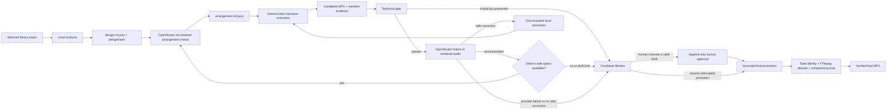

# Automatic Workflow v4 Visual Guide

Automatic v4 owns one selected-track set for the lifetime of a session. Local
analysis and the deterministic design snapshot establish the authoritative
facts. OpenRouter may choose an arrangement from measured candidates and review
registered rendered audio, but it never produces a context brief, invents
timestamps, executes FFmpeg tools, or approves a final on the user's behalf.

Every automatic mutation is serialized per session, revisioned, and can use an
idempotency key. Candidate technical, musical, human, and correction evidence
is append-only. A correction may only mutate permitted transition fields;
exhausted or non-actionable corrections enter manual review rather than repeat
the same render. The internal manual-review state opens Candidate Review with
all preserved drafts, one A/B player, review evidence, local paths, human
approval, and interrupted-finalization recovery. AI review is recommendation
evidence only. Completion is derived from the
verified finalization transaction, never from the presence of a candidate.
Manual Model mode is separate and retains its intentional expert shell/file-
access boundary when the user explicitly enables it.
