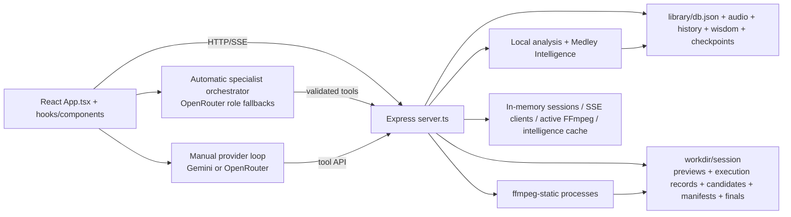
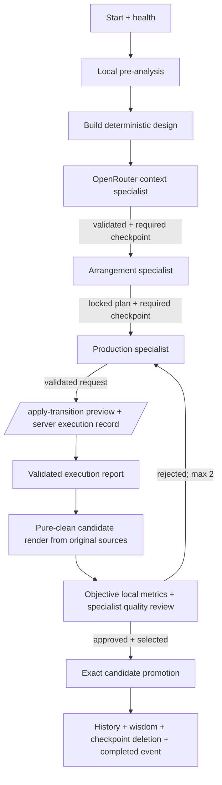
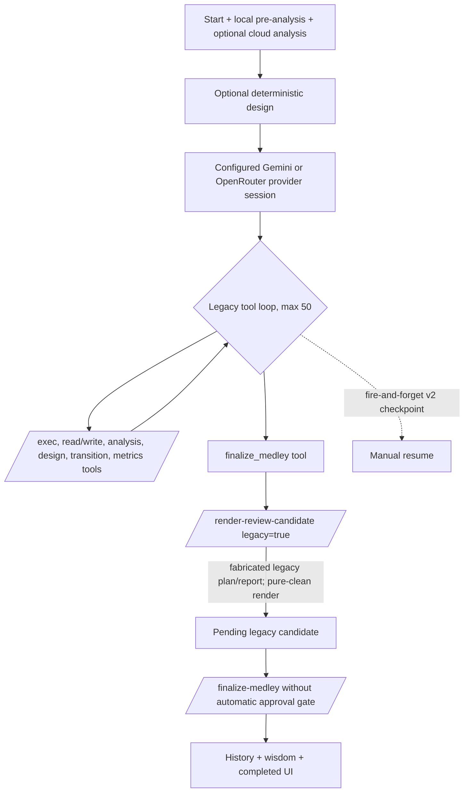

# Complete Stabilization, Verification, and Simplification Audit

Date: 2026-07-03  
Completed: 2026-07-04  
Repository: `G:\ai-medley--main`  
Audit status: Complete with one disclosed, unrecoverable safety exception; the product itself is **not stabilized**  
Controlling specification: `C:\Users\Logan\OneDrive\Documents\# Autonomous Goal Complete Stabiliz.txt`

## 1. Executive summary

The repository contains substantial recent safeguards—strict automatic specialist schemas, server-authoritative execution facts, candidate manifests, hash/size-verified promotion, approval/selection guards, v3 required checkpoints, bounded correction cycles, local-access middleware, and payload preflight—but it is not stabilized. The audit confirms **1 Critical, 24 High, and 10 Medium active findings**. The highest risks are silent overwrite after corrupt core JSON (F-001), false success across legacy/finalization/audio-quality paths, preview/final divergence, unbound resume/session state, unsafe model-driven local file boundaries, and a production artifact that cannot start.

Baseline tests, type checking, and build commands passed, but the successful build is non-runnable in production (F-023). Five of fifteen persisted previews are undecodable; two measurable preview/final join pairs differ by about 3–4 dB mean and 5–6 dB peak. Candidate-to-promoted-final bytes are correct for all five inspected manifests, so the defect is review/render authority and objective gating rather than the current selected-file copy. One of thirteen history entries points to a missing output.

The audit itself has a material safety exception. The baseline `npm test` command overwrote pre-existing `workdir/provider-payload-audit.json` because the test has an undocumented repository write. The prior SHA-256 (`3A0FC0...7BB4`) changed to `B3E6ED...8DDB`; exact bytes could not be recovered. No audio, library JSON, history, wisdom, checkpoint, manifest, candidate, or final output was changed. This incident is F-035 and permanently prevents a claim that the entire original tree was preserved.

The recommended program is incremental, not a rewrite: first isolate verification outputs; then fail-closed atomic persistence and transactional source lifecycle; recoverable finalization; one canonical render/preview timeline plus objective gates; bound analysis/resume/session state; fix providers and semantic provenance; contain local tools and redact secrets; add retention/resource budgets; repair production packaging; then accessibility, dependency, and documentation cleanup. Every phase below has isolated fail-before/pass-after tests, compatibility adapters, preservation guarantees, verification commands, and an independent rollback boundary. No repair was implemented by this audit.

## 2. Audit methodology

This is a read-only, evidence-based audit. Evidence is classified as `REPRODUCED`, `TEST-VERIFIED`, `ARTIFACT-VERIFIED`, `CODE-VERIFIED`, `DOCUMENTED`, `INFERRED`, or `HISTORICAL`. Existing user data and pre-existing working-tree changes are protected. No paid-provider calls, dependency changes, application changes, test changes, destructive cleanup, or real-data failure injection are permitted.

## 3. Repository baseline

| Item | Observed value |
|---|---|
| Root | `G:\ai-medley--main` (`git`: `G:/ai-medley--main`) |
| Branch / upstream | `payload-optimization` / `origin/payload-optimization` |
| Commit | `546287cf692a6f227a00058478af33e7867e0a2c` |
| Staged / deleted | 0 / 0 |
| Working tree | Heavily dirty before audit. Baseline included modified source, tests, plans, package metadata, and untracked implementation files. Current detailed status is 77 modified and 29 untracked paths; all are treated as user-owned. |
| Recent commits | local-access restriction; compact provider payloads; specialist model pipeline; owl-alpha revert/removal pair; final-render path/timing fixes |
| OS / shell | Windows 10.0.26220; PowerShell 7.6.2 Core |
| Node / npm | Node v26.1.0; npm 11.13.0 |
| FFmpeg | System `ffmpeg.exe` 8.1.1 at the WinGet link; bundled `ffmpeg-static` resolves to `node_modules/ffmpeg-static/ffmpeg.exe` |
| Python | `python` 3.13 and `py` launcher available; no active production Python dependency found |
| Disk | At inspection, C: and F: reported 0.00 GB free, D: 0.21 GB, G: 25.37 GB. npm could not write its cache log reliably. |
| Lockfile | `package-lock.json`, lockfile v3, 372 package entries; root dependency declarations match `package.json` |
| Environment names | `GEMINI_API_KEY`, `OPENROUTER_API_KEY`, `NODE_ENV`; Vite also exposes `GEMINI_API_KEY` to the client bundle. `APP_URL` exists only in `.env.example`. Values were never read or printed. |
| Data | `library/db.json`, `history.json`, `wisdom.json`, `audio/`, and `library/checkpoints/` present; workdir contains legacy outputs, automatic candidates/manifests, previews, logs, and final MP3s. |

Declared scripts: `dev` (`tsx server.ts`), `start` (`node dist/server.cjs`), `build` (Vite then esbuild), `clean` (`rm -rf dist`, unsafe and not run), `lint` (`tsc --noEmit`), and a serial 17-entry Node-assertion `test` script.

## 4. Protected-file inventory

Protected classes are source uploads (`library/audio`), `library/db.json`, `history.json`, `wisdom.json`, `library/checkpoints`, every workdir candidate/manifest/preview/debug/final output, environment files, and all pre-existing uncommitted paths. No repository symlink/reparse point was found.

Initial aggregate fingerprints (path plus per-file SHA-256, sorted):

| Path | Files | Bytes | Initial aggregate SHA-256 |
|---|---:|---:|---|
| `library/` | 13 | 31,766,014 | `17ACD03AD96E802622D9BC4E580A4BC8E68FEDB7635597060024D9C52C34B686` |
| `workdir/` | 459 | 1,093,300,984 | `C005F00B2FA472BCC3573F5B5AD0FEC573702BEF93FF1B8CCF302EE9785F7D89` |
| pre-existing `docs/audits/` | 3 | 89,554 | `9588AC6A0595B80F19E4B99C0FE8FB1C827F1DC03FF82FFC938D5F8BEB540E90` |
| `docs/plans/` | 10 | 134,735 | `24D0B9066ECEF6578F7F3FC7B468BC6E7AE97A9A26A07ED34CE2E2A8CCAA87E3` |

Safety exception: `npm test` overwrote the existing `workdir/provider-payload-audit.json` because its write side effect was missed during preflight. The initial report hash is known from the prior audit (`3A0FC0BF2FF8D3D1C52E248C97104DB037E6735524B50CB00598A133D36D7BB4`), the regenerated hash is `B3E6ED759B22BC67038CF25D075D763BD8FBA39A552C4EF817EDF8BE49828DDB`, and exact recovery was not possible from local copies, VSS, or NTFS history. No audio, manifest, checkpoint, history, wisdom, or final output was on that test's write path. This protocol failure prevents a claim of perfect tree preservation.

Final Phase 5 canonical protected fingerprints (`relative slash path|per-file SHA-256`, sorted, UTF-8, no terminal newline) match the Phase 4 checkpoint exactly: library `79951D8CC92712CD2468AE54094C10CFA5D27D62C65F25BCD1F5812FFC612F21` (13 files, 31,766,014 bytes); workdir `F6B7745A97A84CF302C59BD1D0EEA0828969F5A8200EE3AA30CCAD24AB7812FC` (459 files, 1,093,300,984 bytes); plans `37679B427C97FFB0599C1C9C64E6D7BADD8F9A0DAC94E1EE5C2CD35762A06882` (10 files, 134,735 bytes). The regenerated provider artifact remains `B3E6ED...8DDB`. `dist` remains 4 files/859,903 bytes after its controlled restore. Git has zero staged and zero deleted paths; all non-audit modifications/untracked implementation files predated and remained user-owned.

## 5. Verification baseline

| Command | Time (PDT) | Duration | Exit | Result / warnings | Repository side effects |
|---|---|---:|---:|---|---|
| `npm test` | 18:55:48–18:56:10 | 21.359 s | 0 | All 17 entries passed; 117 provider payloads measured; Node emitted repeated `DEP0205 module.register()` warnings | Overwrote protected `workdir/provider-payload-audit.json` (safety exception above) |
| `npm run lint` | 18:55:48–18:55:54 | 5.549 s | 0 | TypeScript `--noEmit` clean | None observed |
| `npm run build` | 19:02:40–19:02:57 | 16.805 s | 0 | Vite/esbuild passed; 717.18 kB JS chunk warning; Node `DEP0205` warning | Original `dist` was moved outside the repo, generated `dist` removed, and original restored. Before/after: 4 files, 859,903 bytes, aggregate `5AB907F5C62E776227C0B94636EF169A779FF25C230C3883EE15A716A7ACADB5`. |
| `npm ls --depth=0 --json` | Phase 0 | <1 s | -4055 | Environmental failure: `ENOSPC` writing npm output/cache log | No repository change detected; npm wrote/attempted a cache log outside repository |

Development and production startup checks are deferred to Phase 4 because they can conflict with an existing process on port 3000 and need controlled process ownership.

## 6. Verification-harness inventory

Available: deterministic tests for medley scoring, synthetic local WAV analysis in an OS temp directory, strict Zod/context validation, specialist payload compaction, config migration, v3 checkpoint schema/required-write behavior, run generation, pre-analysis orchestration, start pipeline, fake-EventSource lifecycle, candidate hashing/promotion/cleanup in temp directories, transition resolution, automatic finalization guards, render-transition selection, local-access filtering, orchestrator checkpoint failure, and provider request size/allowlist audits.

Fixtures: root `dummy.wav` (16 bytes) and `dummy_large.wav` (1,999,484 bytes) are intentionally invalid (`ffprobe` exit 1). The local-analysis test synthesizes a valid WAV. Existing protected library/workdir audio is suitable only for read-only artifact checks. No committed known-BPM, known-key, silence, mono, unusual-sample-rate, short-valid, or long-valid fixture set exists.

Missing: deterministic mocked Gemini/OpenRouter response server, provider status/error matrix harness, full automatic/manual browser E2E, restart-at-stage harness, browser-refresh harness, two-session concurrency harness, atomic-write/failure injection, disk-pressure fixture, corrupt-store fixture suite, FFmpeg hang/kill mock, candidate-render failure injection, and objective preview-versus-final waveform comparison harness.

## 7. Verification limitations

- No live or paid provider requests are permitted; current external model availability and billing behavior remain unverified.
- No destructive/failure injection against real `library` or `workdir` is permitted.
- The two root dummy audio files are invalid; valid audio fixtures are synthesized only inside one test.
- Browser behavior, accessibility, refresh, and multi-tab behavior lack an existing deterministic harness and will be code-verified or marked unverified.
- C: disk exhaustion constrains npm diagnostics and any temp-heavy harness. Isolated work must target G:.
- The existing test runner is a shell chain, not a framework: a crash stops later scripts and there is no coverage report, test isolation registry, retry, or machine-readable aggregate.

## 8. Documentation classification

| Document | Classification | Reason |
|---|---|---|
| `README.md` | Current but incomplete | Correctly describes automatic OpenRouter specialist mode and manual mode; omits detailed recovery, security, persistence, and FFmpeg prerequisites. |
| `AGENTS.md`, `CLAUDE.md` | Contradicted by active code | Describe the legacy loop as the core/default, claim all state is in `App.tsx`, list a Gemini default, and omit automatic specialists, v3 checkpoints, candidate manifests, and current tests. |
| `.env.example` | Contradicted/incomplete | Documents Gemini and unused `APP_URL`, but omits `OPENROUTER_API_KEY`, required by default automatic mode. |
| `2026-06-22-end-to-end-workflow-audit.md` | Historical, partly superseded | Strong trace of then-current automatic path; F-001–F-004 were followed by safeguards and line references drifted. Remaining findings require revalidation. |
| `2026-06-22-foundational-correctness-fixes.md` | Current but incomplete | Accurately describes implemented finalization, transition, checkpoint, and cancellation safeguards; does not constitute whole-system verification. |
| `current-workflow-root-cause-audit.md` | Historical / partly contradicted | Payload metrics remain useful. Its claim that automatic mode ignoring a Gemini/manual selection is necessarily a defect conflicts with the current README/automatic-mode contract; free-model availability remains an external risk. |
| May feature plans | Historical | Implemented concepts evolved materially; use only for intent and legacy compatibility. |
| `archive/apply-musical-transition-tool.md` | Superseded | Explicitly archived; active endpoint/tool exists. |
| `master-refactor-goal-tracker.md` | Historical completion record | Checkboxes record prior work, not current proof. |
| `phase-4-mashup-layer-branching.md` | Historical/unclear | Says implementation was starting; active render code must determine actual support. |
| `pure-clean-*` plans | Historical design context | Draft/ongoing plans; active render implementation is authoritative. |

## 9. Preliminary risk map

Preliminary only, before full phase traces:

1. Multi-store finalization (`candidate manifest` → final copy → history → wisdom → in-memory session) may not be transactional or restart-reconciled.
2. Library/history/wisdom JSON helpers appear synchronous and non-atomic; concurrent writes may lose updates or leave truncated JSON.
3. Module-global session/intelligence/FFmpeg/SSE state may permit cross-session contamination or stale work.
4. Automatic mode is coupled to changing OpenRouter free specialist IDs; model availability is not preflighted and no live evidence is permitted.
5. Current tests lack full workflow, crash recovery, concurrency, browser, and corruption harnesses, so passing unit/contract tests do not prove a complete medley can be produced.
6. Legacy/manual finish and shell/file routes share server state with automatic mode and require proof that safeguards cannot be bypassed.
7. Analysis reuse checks field presence but may not enforce stored file hash/analyzer version before cache reuse.
8. Objective quality gates may prove only technical decodability/duration/loudness, leaving silent gaps, drift, phrase cuts, and preview/final divergence unchecked.
9. Preview, execution report, candidate render, review payload, and promotion have multiple representations; canonical transition enforcement must be traced end to end.
10. Disk growth is already material (`workdir` ~1.09 GB); C: exhaustion demonstrates production and verification error paths under disk pressure are relevant.

## 10. Current architecture diagram

The executable system is a single Express/Vite process. Browser-owned orchestration calls server routes. Automatic specialists run in the browser and use server-issued facts for transition execution/candidates; manual mode retains the legacy provider tool loop. Durable state is split across library JSON, checkpoint JSON, per-session workdir artifacts, candidate manifests, and completed history, while process state is held in module globals.

## 11. Automatic-workflow diagram

## 12. Manual-workflow diagram

Gemini and OpenRouter share the same manual loop and server tools; their provider-session transport/history formats differ. “Legacy” means this manual contract plus v1/v2 checkpoint compatibility, not a separate server binary.

## 13. Stage-by-stage automatic trace

| Stage | Transition owner | Cancellation/resume | Validation and failure |
|---|---|---|---|
| Start/pre-analysis | Browser run-generation pipeline | Browser abort stops callbacks; server analysis is not abort-aware and may persist later | Per-track failures are logged; automatic mode later requires a design |
| Design | Server deterministic engine; global cache | Rebuilt on v3 resume | Local facts exist, but session/design binding is missing |
| Context/arrangement | Browser specialist orchestrator | AbortSignal/120 s timeout; required artifact checkpoint after server POST | Strict Zod + contextual IDs/times; one repair then model fallback |
| Production | Browser specialist; server executes preview | Abort fetch plus `/cancel` kills registered FFmpeg | Request locked to plan; server execution record and report cross-check |
| Candidate render | Server | Active process kill; required checkpoint after candidate response | Original-source preflight, filtergraph, FFmpeg nonzero hard fail, positive duration and local analysis |
| Quality/correction | Browser specialist | Provider abort; candidate/review checkpoint reused | Candidate/version/correction IDs checked; approved review cannot contain blockers |
| Finalization | Server | Not rollback-capable once synchronous transaction begins | Automatic manifest requires approved selected candidate; byte-exact promotion; multi-store transaction gap F-003 |

## 14. Stage-by-stage manual trace

| Stage | Gemini/OpenRouter behavior | Legacy contract / risk |
|---|---|---|
| Provider session | Uses configured provider, model, and provider key through `useModelFallback`/`createProviderSession` | v2 history is provider-specific but compatibility is weakly validated |
| Tool loop | Up to 50 iterations with evaluation/call/stall guards | Model can invoke intentional shell/read/write routes; containment is evaluated in Phase 4 |
| Design/preview | Loose plan accepted when no automatic project brief; preview enriches plan timings | Preview output is not required to decode before loose plan continues |
| Checkpoint | Raw chat/counters fire-and-forget after round trips | Latest turn can be lost; old writes can win |
| Candidate render | `legacy=true` converts loose plan into schema-shaped plan/report and marks every transition successful | Pure-clean renderer still validates sources/timing/FFmpeg, but no authoritative execution-record parity exists |
| Finalization | Candidate size/hash is verified; manifest mode `legacy` bypasses approval/selection requirement | Current UI selects the just-rendered candidate implicitly; no quality-review approval is required |

## 15. Source-of-truth matrix

| Concept | Current authority | Copies / persistence | Refresh/restart/conflict risk | Recommended owner |
|---|---|---|---|---|
| Session identity | Browser-generated ID; route parameter | React refs, `sessions`, checkpoint, workdir, history | v3 validates syntax but no single creation record | Server session record with immutable ID |
| Workflow mode | Config at start plus server hints | browser config, session `workflowMode`, manifest, v3 checkpoint | legacy/unclassified compatibility is inferred | Immutable persisted session metadata |
| Status/stage | Browser orchestrator during run | React state, server session, v3 checkpoint, manifest/history projection | copies can disagree after crash | Persisted server state machine |
| Specialist role/model/attempts | Browser automatic orchestrator | UI, v3 checkpoint, provider audit | opportunistic checkpoint writes may lag | Persisted stage-attempt record |
| Provider/model/key | Manual config; fixed automatic OpenRouter roster | localStorage/config; v3 saves only active model | resume uses current config/key and fixed roster | Immutable run config with redacted key reference |
| Project brief/arrangement | Browser model output validated by server | server memory + v3 checkpoint | replayed after restart; bound to current global context, not a design hash | Versioned persisted project artifact |
| Execution facts | Server `/api/apply-transition` record | server memory; report/checkpoint/candidate projections | server record is lost on restart but resolved candidate survives | Immutable server execution artifact on disk |
| Preview | Server-produced file and execution record | workdir path, report, candidate preview paths | registered paths survive; session record does not | Candidate/execution manifest |
| Candidate bytes/validity | Candidate manifest + file hash/size | workdir file/manifest/checkpoint | manifest semantic crossrefs and idempotent final path are not fully revalidated | Immutable candidate record and verified bytes |
| Review/approval/selection | Quality review + candidate manifest | server session, checkpoint, manifest | automatic promotion requires manifest approval/selection; manual promotion does not | Manifest under one transition function |
| Metrics/progress | Browser review and server session | React, SSE, manifest metrics, history/wisdom | automatic finalization can omit metrics because server session metrics are not updated by review endpoint | Candidate/review record projected to history |
| Final output | Manifest final path plus history/session | workdir final, manifest, history, server memory | multi-step writes can disagree; legacy finish can record unverified path | Finalization transaction record |
| Track intelligence | Last design request globally | module-global cache; library per-track data | concurrent sessions overwrite cache | Session/design-hash keyed immutable design |
| Library | `library/db.json` | browser snapshot, server rereads | corrupt read becomes empty; no revision/CAS | Atomic versioned store |
| History | `library/history.json` | server startup session projection | non-atomic; one existing entry points to missing output | Atomic store + startup reconciliation |
| Wisdom | `library/wisdom.json` | read into each design | fallback non-atomic; append can be skipped on finalization retry | Atomic append/transactional outbox |
| Checkpoint sequence | v3 `activeRequestSequence` + `savedAt`; none for v2 | checkpoint JSON | v3 stale protection; v2 last write wins | Monotonic server-issued sequence |
| Cancellation generation | browser run-generation/request sequence | refs only | lost on refresh; server only kills active render process | Persisted run generation + server cancellation token |

## 16. API contract inventory

All API routes inherit the loopback/local-access middleware (`127.0.0.1`/`::1` remote address plus Origin and `Sec-Fetch-Site` checks) and CORS allowlist. There is no user authentication or authorization because the intended deployment is local-only. `S` below means server memory (`sessions`, SSE clients, active render processes, track-intelligence cache); `L/H/W/C/M` mean library/history/wisdom/checkpoint/candidate-manifest files. A dash means no material durable state. Error bodies are generally `{error}` with 4xx for validation/not-found and 500 for unexpected failures; exact statuses vary and are not represented by a shared error contract.

| Method/path | Mode / caller | Request → response contract | Validation / semantic authority | Reads → writes / cancellation / retry | Tests and material gap |
|---|---|---|---|---|---|
| `GET /api/config` | All / `useConfig` | none → raw Gemini/OpenRouter keys | none beyond local access | environment → —; safe retry | No route test; exposes secrets to any same-origin script (F-030) |
| `GET /api/session/:id/stream` | All / SSE hook | path ID → SSE log/metrics/completed | ID only | S → S client list; close removes client; reconnect safe but no replay | Controller unit test only; no route/event-order test (F-015) |
| `POST /api/session/:id/cancel` | All / cancel UI | path ID → status | ID only; kills only keyed active candidate renderer | S → S; repeat is effectively safe | No route/process-tree test; other FFmpeg/provider/analysis work survives |
| `GET /api/library` | All / library hook | none → library array | parse failure collapses to empty | L → —; safe retry | No corruption route test; F-001 |
| `POST /api/library` | All / upload UI | multipart `files` → created records | original extension retained; no MIME/content/size/duplicate validation | upload temp/audio + L → audio + L; no abort transaction; unsafe retry duplicates | No route test; orphan-on-DB-failure and disk DoS (F-008/F-028) |
| `PUT /api/library/reorder` | All / drag UI | loose `orderedIds` → library | array/membership handling only; no revision/CAS | L → L; repeat same order idempotent | No concurrency/corruption test; lost-update risk |
| `DELETE /api/library/:id` | All / library UI | ID → success | record lookup; trusts persisted `entry.path` | L/audio → unlink then L; cancellation absent; retry may 404 | No failure-injection test; delete-before-save data loss (F-008) |
| `POST /api/checkpoint` | All / checkpoint managers | v3 strict or legacy loose object → status | v3 schema/stale guard; v2 shape not semantically checked; history suppresses completed ID | H/C → C; request sequence partly idempotent | Automatic/checkpoint unit tests; no crash/corrupt/legacy contract test (F-006/F-007) |
| `GET /api/checkpoints` | All / resume banner | none → summaries | invalid JSON silently omitted | C → —; safe retry | No corrupt/quarantine test |
| `GET /api/checkpoint/:sessionId` | All / resume | ID → checkpoint | parse only; ID/path construction not shared with candidate guard | C → —; safe retry | No traversal/semantic-v2 test |
| `DELETE /api/checkpoint/:sessionId` | All / completion/discard | ID → status | existence only | C → delete C; retry returns not-found semantics | No traversal/idempotency test |
| `GET /api/audio-raw/:id` | All / analyzer | library ID → source stream | library record plus lexical readable-path check | L/audio → —; stream close cancellation | No symlink test; F-029 |
| `GET /api/audio-probe/:id` | All / analyzer/UI | ID → FFprobe JSON | record/path then FFprobe exit | L/audio → process only; disconnect does not kill probe | No malformed/unusual-layout route test |
| `GET /api/waveform/:id` | All / UI | ID → waveform values | record/path; FFmpeg errors handled | L/audio → process only | No long/invalid/cancel test |
| `POST /api/session/finish` | Legacy only / deprecated client path | loose final path, summary, metrics → session/history | automatic guard only; no final path existence/hash/containment | S/H/W/output → S,H,W; multi-step, not cancellation-safe or idempotent | Guard tests cover automatic rejection, not legacy integrity; F-002 |
| `POST /api/session/metrics` | Manual / progress tool | loose session/metrics → status | session ID and numeric normalization are weakly split client/server | S → S + SSE; repeat overwrites/duplicates log | No route/schema test |
| `GET /api/session/:id` | All / restore/status | ID → session | memory lookup only | S → —; safe retry | No restart reconciliation test |
| `GET /api/audio/:id` | Completed / player | history ID → range MP3 | history lookup/path exists; lexical path trust | H/output → —; stream close cancellation | Range behavior manually verified historically; no path-tamper test |
| `GET /api/audio/:id/download` | Completed / history | history ID → attachment | same as playback | H/output → — | No tampered-history/content-type test |
| `GET /api/audio-file` | Manual / model/browser | arbitrary query `path` → stream | lexical allowlist under library/workdir only | filesystem → — | No symlink/absolute-edge contract test; F-029 |
| `POST /api/audio-analysis/local` | All / pre-analysis | library ID → analysis | record/path; analyzer output not semantically gated | L/audio → L; client abort does not stop/persist guard | Analyzer unit test; no invalid/zero/abort route test (F-014/F-024/F-025) |
| `POST /api/medley-intelligence/design` | Automatic/manual / start | config + tracks → design | broad shape, deterministic engine | L/W → module-global S cache; retry recomputes | Engine unit test; cross-session and scaling absent (F-005) |
| `POST /api/section-pair-evaluate` | Manual/automatic helper | track/section pair → candidates | checks current global cache IDs/ownership | S → W via later execution only | No concurrent-session route test; can validate against wrong design |
| `POST /api/medley-quality` | All / finalizer | file path → loudness metrics | path resolution; positive decode/probe behavior, no quality thresholds | output → — | No silence/clipping/target-threshold contract test (F-026) |
| `POST /api/session/project-brief` | Automatic / context specialist | strict brief + context → accepted brief | Zod plus project/track/section/order context | S → S/checkpoint via caller | Context tests; factual-value provenance gap F-018 |
| `POST /api/session/execution-report` | Automatic / production specialist | strict report → accepted server facts | IDs/version/plan/execution equality strong | S/M → M/S | Schema/orchestrator tests; no concurrent correction route test |
| `POST /api/session/quality-review` | Automatic / reviewer | strict review → stored review | candidate/version/blocker/correction-ID checks; scores not objective | S/M → M/S | Validator tests; objective gate absent (F-026) |
| `GET /api/session/:sessionId/candidates` | Candidate workflows / UI/orchestrator | ID → manifest | guarded session ID + schema | M → —; safe retry | CandidateStore tests; no corrupt-route UI test |
| `POST /api/session/design-plan` | Manual/automatic / design tool | loose/manual or strict/automatic plan → plan | workflow-dependent; automatic contextual checks, manual loose | S → S | Automatic validators tested; manual schema gap F-020 |
| `POST /api/apply-transition` | All / production/manual tool | transition request → actual timing/preview | automatic plan lock and execution version; manual fields looser | S,L,W/audio → preview,W,S; active process/cancel race | Transition tests cover resolution, not real route/FFmpeg parity; F-011–F-013 |
| `POST /api/render-review-candidate` | Candidate workflows / orchestrator/manual finalizer | session/design/execution → registered candidate | automatic guard, plan/execution checks, path/hash/manifest registration | L,S,M → `.part`, MP3, M, S; keyed kill; retries can find existing artifacts | Candidate/render-selection tests; no process/crash/quality-gate integration (F-026) |
| `POST /api/finalize-medley` | Candidate workflows / orchestrator/manual | session/candidate selection → final/history | automatic approval/active selection; normal hash/size/path check | M,H,W,C,S/candidate → final,M,H,W,delete C,S; no transactional cancel; process lock | Guard/store tests; partial-failure and idempotent-branch gaps F-003/F-004 |
| `DELETE /api/session/:sessionId/discard` | Candidate workflows / UI | session ID → cleanup result | automatic candidate guard and preservation rules | M,C,S/workdir → delete rejected/candidate metadata, C,S | Store tests partly cover cleanup; no crash/concurrent finalization test |
| `GET /api/history` | All / history UI | none → entries | corrupt read becomes empty | H → — | No corrupt/missing-output reconciliation test; F-001/F-009 |
| `DELETE /api/history/:id` | All / history UI | ID → status | entry lookup; does not delete completed output | H → H | No concurrency/corruption test |
| `GET /api/health` | All / startup | none → `{status}` | local middleware only | — → —; idempotent | Used in dev smoke check; production cannot start (F-023) |
| `POST /api/exec` | Manual / shell tool | loose `command`,`sessionId` → stdout/stderr | command intentionally arbitrary; FFmpeg path replacement; session ID not contained | filesystem/process → arbitrary command effects/workdir; no robust tree cancellation; unsafe retry | No security/containment test; intentional shell plus path escape F-027 |
| `GET /api/file-read` | Manual / file tool | arbitrary `path` → text | no containment/allowlist/size/redaction | arbitrary filesystem → — | No route security test; local model prompt is not authorization (F-027) |
| `POST /api/file-write` | Manual / file tool | arbitrary `path`,`content` → status | no containment/allowlist/atomic write | filesystem → arbitrary file; unsafe retry for non-identical content | No route security test; F-027 |
| `POST /api/library/analysis` | Manual/cloud/local / analysis saver | ID + free-form analysis → record | library ID only; no provenance/version/hash | L → L | No stale/concurrent/schema test; F-025 |
| `POST /api/library/cache` | Cloud analysis / Gemini URI cache | ID, URI, expiry → record | library ID/basic fields; provider URI trusted | L → L | No expiry/changed-file/concurrency test |
| `ALL /api/*` | All / unknown caller | any → 404 JSON | none | — → — | Fallback behavior straightforward |

No route has a transactional cross-file request boundary, request ID, ETag/revision, or standardized idempotency key. The candidate store is the strongest isolated subsystem; the core JSON routes are the weakest. Full Express contract tests exist only around selected guards and local-access middleware, not the complete route surface.

## 17. Provider-routing matrix

| Mode/action | Provider/key | Primary model | Fallbacks | Selection honored? |
|---|---|---|---|---|
| Automatic context | OpenRouter / `openrouterApiKey` | Nemotron 3 Super free | Ultra free, Nex-N2-Pro free | Mode contract honored; manual provider/model fields intentionally ignored and hidden |
| Automatic arrangement/review | OpenRouter / `openrouterApiKey` | Nemotron 3 Ultra free | Super free, Nex-N2-Pro free | Fixed role roster |
| Automatic production | OpenRouter / `openrouterApiKey` | Nex-N2-Pro free | Ultra free, Super free | Fixed role roster |
| Manual Gemini loop | Gemini / `geminiApiKey` | configured model | selected, 2.5 Flash, 2.5 Pro | Normally yes; stale fallback index can start later runs on a fallback (F-017) |
| Manual OpenRouter loop | OpenRouter / `openrouterApiKey` | configured model/custom ID | selected plus five fixed free models | Same stale-index gap; provider switch can retain incompatible model ID |
| Optional cloud audio analysis | Manual configured provider/key/model | configured model | none | Yes; Gemini cancellation incomplete |
| Local analysis/render/finalization | None | None | None | Deterministic local path |

As of this audit, official OpenRouter pages exist for all three automatic IDs and for `openrouter/owl-alpha`; this proves listing, not quota/endpoint/tool-call availability: [Nemotron Super](https://openrouter.ai/nvidia/nemotron-3-super-120b-a12b:free), [Nemotron Ultra](https://openrouter.ai/nvidia/nemotron-3-ultra-550b-a55b:free), [Nex-N2-Pro](https://openrouter.ai/nex-agi/nex-n2-pro:free/pricing), [Owl Alpha](https://openrouter.ai/openrouter/owl-alpha). No inference request was made.

## 18. Provider-error decision table

| Failure | Automatic specialists | Manual OpenRouter | Manual Gemini | Diagnostic gap |
|---|---|---|---|---|
| Payload >100 KiB or >24k estimate | Pre-network 413, then next role model repeats same oversized payload and fails | Pre-network 413; generic failure normally ends run | No shared measurement/limit | No compaction/actionable largest-component UI |
| 429/rate limit | Transport retries once after fixed 2 s, then next model | Transport retry plus up to five outer exponential retries; duplicate message growth | Outer retry only when error text matches | Ignores `Retry-After`; call amplification |
| 402/quota | Generic immediate next specialist model | Explicit next-model switch | Generic unless message happens to match | Automatic user sees only fallback log; free roster can all share quota constraints |
| 401/403 auth | Tries every model with same bad key | First generic failure normally ends run | First generic failure normally ends run | No key-specific actionable classification |
| 404/model unavailable | Immediate next automatic model | Detection searches message for response-body phrase that transport omits; usually generic failure | Generic | Selected/custom model may not fall back |
| Timeout | 120 s then next model | Generic first failure normally ends run | Generic first failure normally ends run | No per-stage countdown or timeout/fallback decision table in UI |
| Malformed structured output | One repair request, then model fallback | Manual tools have loose schemas; individual tool errors returned | Same | Manual semantic repair is model-loop emergent, not contractual |
| Invalid tool/no tool | Expected tool missing → automatic fallback | Text/empty streak; model switch after three occurrences | Same | Recovery message result/tool calls are discarded |
| All fallbacks fail | Last error thrown; checkpoint preserves last stage | Run error after applicable retry/switch rules | Same | Aggregated attempts/status/body are not persisted server-side |
| Abort | Browser signal/timeout aborts fetch/chat wrapper | Browser run generation suppresses callbacks | SDK file upload/generation may continue | Provider-side cancellation/credit use unverified |

## 19. Prompt/schema/runtime matrix

| Contract | Prompt/tool | Structural schema | Semantic/runtime validation | Ignored/recomputed/contradictory fields |
|---|---|---|---|---|
| Context brief | `submit_project_brief` only | Strict Zod/JSON schema | project/session ID, track/section ownership/order | target duration and track factual values are not compared to source design |
| Arrangement | `set_design_plan` only | Strict plan/transition schema | track/section ownership, timestamps, order, count | no deterministic candidate ID/provenance; strategy/confidence/warnings not authoritative |
| Production request | `apply_musical_transition` allowlist | Explicit JSON + strict Zod | exact locked IDs/style/duration/beat permissions | `notes` non-operational; no gain/tempo contract |
| Execution report | `submit_execution_report` once | Strict schema | plan versions/IDs plus every server execution fact | model warnings/completion time are advisory; server facts win |
| Quality review | supplied facts only | Strict schema | active candidate/version, plan correction IDs, approved has no blockers | subjective scores overwrite candidate metrics; no objective threshold gate |
| Manual design | `set_design_plan` | Array has no item schema; server accepts loose transitions | soft score warnings only | tool `sessionId` ignored; server uses browser session ID |
| Manual transition | style guidance | loose string/number fields | basic required fields; no style enum/plan lock | `intensity` affects only wisdom/estimated score; actual timing recomputed by server |
| Manual progress | integer 0–100 prompt | numbers, not integer/min/max in tool schema | metrics manager normalizes | scores do not gate finalization despite wording history |
| Manual finish | `finish_medley` deprecated; `finalize_medley` required | final path/summary/useCleanRender required | browser uses summary only | `finalMp3Path` and `useCleanRender` ignored; server always renders candidate |
| Manual file/shell | diagnostics-only prose | broad strings | server security boundary only | prompt policy is not an authorization boundary |

The manual system prompt says the renderer “fully supports” mashup branching, contradicted by F-011. Automatic prompts are smaller and role-allowlisted. Manual Gemini schema conversion is untested against every SDK-supported JSON-schema keyword, and `set_design_plan.transitions` lacks `items` for both providers.

## 20. Semantic-validation matrix

| Model-produced value | Boundary | Current result / gap |
|---|---|---|
| project/session ID | orchestrator + project-brief route | Exact match enforced automatic |
| track IDs/order | brief/arrangement context validators | Existence, completeness, uniqueness/order enforced automatic |
| section IDs/ownership | context validators | Ownership enforced automatic; manual only pair endpoint validates existence |
| timestamps | arrangement context + render preflight | In-section/source duration enforced automatic; does not require candidate provenance |
| transition ID | plan/report validators | Report membership/duplicates checked; plan transition-ID uniqueness not checked |
| deterministic transition candidate | none | Arrangement can invent a structurally valid unscored pair (F-018) |
| project factual fields | schema only | Model can alter duration/tempo/key/filename/confidence and target duration |
| execution version/facts | execution-report route + resolver | Strong server equality and candidate-version binding |
| preview path | server equality + basename/path pattern | Path equality/containment, but not decodability/hash (F-012) |
| candidate ID/version | review/finalize routes | Registered/version match and automatic active selection enforced |
| approval/blockers | review route | Approved+blocking rejected; score/objective consistency not enforced |
| correction transition ID | quality-review route | Must exist in current plan when plan parses |
| parent candidate | schema only | Parent existence/acyclicity not enforced |
| final path | candidate store normal branch | Normal fixed path strong; idempotent/legacy gaps F-002/F-004 |
| manual tool file/path/command | individual server routes | Not validated against model prompt; security audit in Phase 4 |

Payload evidence: the current generated audit contains 117 passing 3/4-track automatic requests. Maximum is 17,457 bytes / 5,807 estimated tokens (arrangement repair), below 102,400 bytes / 24,000 tokens. The exact OpenRouter serialized body is measured. The evidence does not bound 5–100 tracks, manual 50-turn history, Gemini requests, large custom instructions, or repeated error/retry histories.

## 21. Audio-analysis provenance matrix

| Derived datum | Input/tool/algorithm | Provenance persisted | Cache enforcement | Invalid/fallback behavior |
|---|---|---|---|---|
| File identity | SHA-1 over source bytes | `fileHash`, source path/library ID indirectly | **Not checked** by `App` reuse decision | Changed bytes can reuse stale analysis (F-025) |
| Analyzer identity | `local-analysis-v2.0.0` plus optional Essentia version | `analyzerVersion`, feature flags | **Not checked** by reuse decision | Algorithm upgrades can reuse stale sections/IDs |
| Probe facts | FFprobe duration/sample rate/channels/layout | duration/sample metadata | Field-presence reuse only | `execFfmpeg` helper ignores FFmpeg errors; zero/empty output can continue (F-024) |
| PCM decode | FFmpeg mono float32 at 44.1 kHz to UUID temp file | decode settings/source string | Not separately cached | Entire decoded track held in memory; temp cleanup in `finally` |
| Tempo/beats/downbeats | `music-tempo`, onset envelope, heuristics | BPM, beat arrays, confidence, source/warnings | Presence only | Failure returns low-confidence/null/fallback values, not a hard invalid result |
| Key | internal chroma plus optional Essentia tonal extractor | key/mode/confidence/source | Presence only | disagreement/failure becomes warning/confidence, not rejection |
| Loudness/peak/silence | FFmpeg `volumedetect`/`silencedetect`, PCM features | mean/peak/silence and warnings | Presence only | Fixed 30 s command timeout; missing/NaN values are normalized/fallback rather than rejected |
| Energy/spectral/sections | FFT frames, onset/energy segmentation and scoring | arrays, stable-looking section IDs, confidence | Presence only | IDs are not bound to file hash/version; unusual/short/zero input has no semantic acceptance gate |
| Essentia features | Optional dynamic `require`, first 180 s capped | availability/version and tonal values | Dependency presence affects result but not invalidation | Missing package is tolerated; installed in current lock/install |
| Persisted analysis | `/api/audio-analysis/local` then `updateLibraryEntry`; manual `/library/analysis` | current record plus unbounded `analysisHistory` | No compare-and-swap to starting hash/version | Cancelled/stale request can overwrite newer record; history grows without bound |

The analyzer has useful provenance fields but the consumer does not enforce them. Static inspection covers mono/stereo resampling and metadata capture; unusual channel layouts/sample rates, very short/long files, NaN/Infinity, and zero-duration acceptance lack safe isolated route fixtures. Existing `dummy*.wav` files are invalid, so they do not establish supported audio behavior.

## 22. Transition-authority matrix

| Field | Planned authority | Preview/execution | Candidate/final | Result |
|---|---|---|---|---|
| Track/section IDs | Locked automatic arrangement | Request must exactly match plan; server record | Resolved record drives original-source segments | Enforced automatic; loose legacy |
| Exit/entry | Plan, then server beat-snapped actuals | Server records actual values | Automatic render requires in-section server actuals | Enforced, but context cache is global |
| Duration | Locked plan unless explicit bounded permission | Request/server record | `durationUsed` drives final crossfade | Enforced automatic |
| Style | Locked/allowlisted plan | Shared style config selected | Shared enum/config, but filter topology/placement differs | Same name, materially different signal operation |
| Beat alignment | Locked request flag | May snap if beat within 0.25 s | Uses snapped actual times | Timing carried; snap provenance only in transient response/wisdom |
| Curves/EQ | Style config | Per-input EQ then acrossfade | Acrossfade then EQ, or mashup branch | Not parity |
| Gain/loudness | Not plan-authored | Per-input `loudnorm` | One final `loudnorm`+limiter | Not parity |
| Tempo adjustment | No active schema/operation | None | None | Unsupported, despite audit requirement to trace |
| Sample format/rate/channels | Implicit input/FFmpeg | No explicit aformat | Explicit float/48 kHz/stereo | Artifact metadata happens to be 48 kHz stereo, not contract parity |
| Codec | Server command | MP3 libmp3lame 320k | MP3 libmp3lame 320k | Equivalent encoding target |
| Preview path | Server execution record | Registered session file | Not consumed in final; included as evidence | Decodability/hash not validated |

## 23. Preview/final parity matrix

| Style | Preview | Final candidate | Classification |
|---|---|---|---|
| `smooth_blend` | Two duration-sized clips, each loud-normalized, triangular acrossfade | Full segments, triangular acrossfade, one final loudnorm+limiter | Quality-affecting difference |
| `beat_aligned` | Same with logarithmic curves and snapped times | Same curves/times, different gain/master chain | Quality-affecting difference |
| `energy_ramp` | High-pass on each input before exponential crossfade | High-pass appended after crossfade | Quality-affecting difference |
| `harmonic_blend` | EQ on each input before triangular crossfade | EQ appended after crossfade | Quality-affecting difference |
| `dramatic_cut` | Exponential acrossfade | Exponential acrossfade, not an actual cut; master differs | Semantic/quality gap |
| `reset_moment` | Logarithmic acrossfade | Logarithmic acrossfade; master differs | Quality-affecting difference |
| `mashup_layer` | EQ on both inputs followed by a duration-sized acrossfade | Incoming full segment is EQ'd and mixed from timestamp zero with the entire current chain using `amix duration=first`; transition duration is not applied to the branch | **Correctness defect** |

Artifact evidence (`6avzjs2c`): final candidate is a valid 48 kHz stereo 320 kb/s MP3. Its three computed 5 s join windows contain no ≥0.1 s silence below -50 dB. Join mean/max levels were -20.6/-7.4, -19.9/-7.7, and -20.1/-8.1 dB. Valid previews 1 and 3 were -17.7/-1.6 and -15.9/-3.0 dB: roughly 3–4 dB higher mean and 5–6 dB higher peaks than final windows. Preview 2 was undecodable. Across all five manifests, 5 of 15 registered previews are FFprobe-invalid (8,289–10,856 bytes), while all five final candidates match promoted final hashes. Evidence: `ARTIFACT-VERIFIED`. Exact sample comparison is impossible for the invalid previews and no repository harness aligns/compares decoded waveforms.

## 24. Candidate-integrity matrix

| Transition / invariant | Current behavior | Evidence | Gap |
|---|---|---|---|
| Identity/limit | Sequential `candidate-NNN`, max 3 complete candidates | CODE/TEST-VERIFIED | Duplicate registration returns existing manifest without proving supplied object equals existing record |
| Registration | Candidate schema, size/hash fields, atomic manifest write | CODE/TEST-VERIFIED | Registration trusts caller-computed candidate record; semantic path/session crossrefs are separate |
| Path containment | Registered path equality, real parent under real session directory, symlink rejection | CODE/TEST-VERIFIED | Existing-file check is skipped when absent; idempotent final-path branch bypasses these checks |
| Technical validity | Render computes metrics then records `technicallyValid` | CODE-VERIFIED | No independent re-analysis during registration/promotion beyond size/hash |
| Review | Registered candidate/version checked; approved+blocking rejected; correction IDs checked when plan exists | CODE/TEST-VERIFIED | Review scores are subjective model claims; candidate metrics may be overwritten by them |
| Selection | `chooseBestCandidate` prefers newest approved, else highest technically-valid score | CODE-VERIFIED | Manifest schema does not require selected ID to exist; manual finalization can select a pending candidate implicitly |
| Promotion | Source size/SHA checked; copy to `.part`; copied size/SHA checked; rename; manifest updated | CODE/TEST/ARTIFACT-VERIFIED | No fsync for final file/directory; crash reconciliation absent; idempotent branch does not reverify |
| Existing artifacts | Five manifests each have one present candidate with matching recorded hash/size and final bytes matching candidate hash | ARTIFACT-VERIFIED | All five are historical unclassified manifests; guard treats them as automatic |

## 25. Finalization transaction matrix

| Step | Automatic/manual candidate route | Failure state / retry |
|---:|---|---|
| 1 | Validate session, manifest, workflow classification, approval/selection when automatic | Fails closed for automatic/unclassified candidate manifests |
| 2 | Verify candidate path, presence, technical flag, size, SHA | No mutation before success |
| 3 | Copy to `medley_final.mp3.part`, rehash, rename to final | Crash may leave `.part` or final without manifest state; no startup reconcile |
| 4 | Atomically rewrite candidate manifest with finalized ID/path | If write fails, final bytes may exist without finalized manifest; retry recovers only if replacement semantics cooperate |
| 5 | Mark server session completed | In-memory only; may precede durable history |
| 6 | Write history (direct, non-atomic) | Failure returns 400 after final/manifest and in-memory completion; corrupt/partial history is possible |
| 7 | Append wisdom | Failure after history causes 400; retry sees history and permanently skips wisdom append |
| 8 | Delete checkpoint | Failure returns 400 after durable completion; retry can repeat deletion but not missing wisdom |
| 9 | Best-effort cleanup rejected candidates | Warning returned; manifest retains references to removed rejected artifacts |
| 10 | Broadcast/respond success | Client timeout can retry; session lock is process-local and promotion is only conditionally idempotent |

`POST /api/session/finish` is a second active legacy completion route. It rejects automatic/unclassified candidate sessions, but otherwise marks completion and writes history before verifying that the supplied absolute/relative path exists, is audio, or is inside the session. It then performs best-effort quality analysis and appends wisdom. Current UI manual mode instead renders a legacy candidate and calls `/api/finalize-medley`.

## 26. Checkpoint/resume matrix

| Version / stage | Write contract | Validation | Resume/restart behavior | Gap |
|---|---|---|---|---|
| v3 automatic | Required boundaries awaited; diagnostic writes opportunistic; temp+rename | Strict Zod; stale request-sequence/time rejected | Rebuilds design from current library/config, replays persisted brief/plan; candidate/review reused at review/final stages | No immutable design/library hash or run-config snapshot; no fsync/dir sync; corrupt old v3 can be replaced |
| v2/manual | Fire-and-forget after model rounds | Endpoint accepts any non-v3 object; browser checks only ID, history array, iteration number | Recreates provider chat with current config/model fallback; workdir reused | Write may be lost while telemetry says saved; schema/version/model/config semantics weak; stale writes last-win |
| Completed | Finalizer deletes checkpoint; POST ignores IDs already in history | History lookup | Completed sessions restored from history only when path exists | Failure ordering can leave checkpoint after completion; missing history path is silently omitted from restored sessions |
| Corrupt | list silently drops invalid JSON; v3 guard returns null | GET parse can throw; v2 browser may accept semantically stale data | No quarantine/diagnostic/reconciliation | Corruption is hidden and may be overwritten |

## 27. Cancellation matrix

| Stage | Browser control | Server/provider control | Durable result / gap |
|---|---|---|---|
| Health/design fetch | AbortSignal + run generation | HTTP request abort only | Stale browser callback blocked |
| Local pre-analysis | AbortSignal blocks client continuation | Server analyzer/FFmpeg has no request-abort signal and can still call `updateLibraryEntry` | Cancelled run may mutate library later (F-014) |
| Optional cloud analysis | Signal checked around steps | Gemini SDK upload/generate calls do not receive abort signal; OpenRouter fetch does | Paid/external call may continue in Gemini mode |
| Provider specialist/manual request | Generation guards | OpenRouter fetch and Gemini chat wrapper race against AbortSignal/timeout | Browser ignores stale result; external cancellation guarantees vary |
| Preview FFmpeg | Fetch abort + `/api/session/:id/cancel` | Keyed active process killed | Race after FFmpeg completion can still append wisdom/session facts |
| Candidate render | Same | Strict renderer process keyed/killed; `.part` removed in catch | Debug/error artifacts may remain intentionally |
| Final promotion | Fetch can abort | Synchronous server mutation has no cancellation boundary | Completion may commit after browser returns idle |
| SSE | Controller generation, timers cleared | Response close removes client | No replay; missed completion possible |
| New run | request-sequence + run-generation refs | New session ID normally isolates workdir | Global intelligence/wisdom/library remain shared |

## 28. Failure/recovery matrix

Phase 1 subset:

| Failure | Current durable state | Retry/resume | User-visible result |
|---|---|---|---|
| Candidate missing/hash/size mismatch | Manifest unchanged | Repair/re-render required | 400 with integrity error |
| Crash after final rename, before manifest | Final may exist; manifest not finalized | No startup reconciliation; retry attempts promotion | Error/unknown after restart |
| History write fails | Final+manifest completed; session may say completed | Retry sees no history and retries writes | 400 despite valid final |
| Wisdom write fails after history | Final+manifest+history completed | Retry skips wisdom because history exists | First call 400; retry success with permanent wisdom gap |
| Checkpoint deletion fails | Completion durable; checkpoint remains | POST checkpoint later ignored due history | 400 or stale interrupted-session UI until refresh/list behavior resolves |
| Core JSON corrupt | Read helper returns empty list | Next mutation overwrites data | Silent apparent empty state/data loss |
| Server restart mid-run | Workdir/checkpoint survive; server executions/session cache lost | v3 replay or v2 chat resume | Resume offered only from readable checkpoint |
| Browser refresh | Browser refs/state lost | Checkpoint banner reloads | Latest opportunistic/manual work may be absent |
| Concurrent sessions | Per-session workdir/manifest/render process mostly isolated | Global intelligence and shared JSON remain coupled | Possible wrong-context validation/scoring |
| Local analysis FFmpeg fails | Analyzer can continue with empty/zero fallback data | Route may persist a nominal analysis | False analyzed state instead of actionable decode failure |
| Production startup | Build command exits 0, generated `.cjs` contains ESM import syntax | `node dist/server.cjs` fails before listening | Release artifact is non-runnable (F-023) |
| Workdir/disk fills | No retention limit; upload has no size limit | Later upload/render/write fails non-transactionally | Partial artifacts and potential source/library inconsistency |

## 29. Persistence matrix

| Store/artifact | Write method | Atomic/serialized/idempotent | Partial failure / reconciliation | Risk |
|---|---|---|---|---|
| `library/db.json` | direct `writeFileSync` after read/modify | No / event-loop synchronous only / no | parse errors return `[]`; no backup/reconcile | Critical silent overwrite/data loss |
| `history.json` | direct `writeFileSync` | No / no cross-process lock / ID check only in candidate finalizer | parse errors return `[]`; missing output retained | Critical silent overwrite; contradictory completion |
| `wisdom.json` | temp+rename, then direct-write fallback | Partial / common temp name / append not deduped | parse errors return `[]`; no outbox/reconcile | Loss/duplication and fallback truncation |
| v2/v3 checkpoints | common `.tmp` then rename | Atomic rename, no fsync; v3 stale check; v2 last-win | corrupt list entries hidden; no quarantine | Lost/stale resume state |
| Candidate manifest | fsync temp file + rename; process-local session lock used by render/finalize/discard | Strongest store; no directory fsync; some sync mutations outside explicit lock | corrupt schema fails closed; no crash reconciliation | Semantic/idempotency gaps |
| Candidate/final MP3 | FFmpeg `.part`/copy/rehash/rename | Size/hash verified for normal promotion | orphan `.part`/final possible | Recoverable only manually/retry |
| Source upload | multer writes file, then DB append | Not transactional | DB failure leaves orphan file | Storage leak |
| Source delete | unlink source, then DB save | Not transactional/idempotent response | DB failure leaves record pointing to deleted source | Source data loss |
| Preview/debug | direct writes under session | Partial registration | cleanup is best effort | Growth/orphan risk |

## 30. Session-isolation matrix

| State | Scoped? | Isolation behavior | Finding |
|---|---|---|---|
| `sessions` | Keyed by session ID | Independent objects; no durable running-session owner | Restart loses all running state |
| workdir/manifests/locks | Session directory/key | Validated IDs and path containment; process-local lock | Good single-process isolation |
| active FFmpeg | Keyed by session ID | Cancel affects named process | Only candidate render process is represented; other FFmpeg helpers may not be cancellable |
| SSE clients | Keyed by session ID | Connection arrays and heartbeat cleanup | Browser controller evaluated in Phase 2 |
| track intelligence | **Global last-write** | Every design request replaces it; validation/evaluation uses latest cache | Cross-session contamination (F-005) |
| library/history/wisdom | Global JSON | All sessions share read/modify/write stores | No revision/transaction/cross-process protection |
| browser run generation | Per tab in refs | Blocks stale callbacks within one mounted app | Not shared across tabs/server; lost on refresh |
| configuration | Per browser localStorage | Each tab may differ | v3 resume uses current tab config, not original run config |

## 31. Security attack-surface matrix

| Surface / intended trust | Current boundary | Exposure / disposition |
|---|---|---|
| Network listener | Binds loopback; middleware rejects non-loopback remote addresses, disallowed Origin, and cross-site fetch metadata | Appropriate local-only base; no Host validation, so browser DNS-rebinding assumptions are not explicitly defended/tested |
| CORS/browser origin | Fixed localhost/127.0.0.1 origins | Blocks normal foreign-origin reads; does not protect against a same-origin compromise, extension, or local process |
| API keys | `/api/config` returns keys; browser stores them in localStorage | Any same-origin script/XSS/extension can read them; no response redaction or server-only provider proxy (F-030) |
| Upload | UUID storage name limits filename traversal; original extension/name retained | No byte/MIME/extension/size/duplicate validation; unbounded local disk consumption and non-audio ingestion (F-028) |
| Library/source deletion | Library ID lookup, then unlink persisted path | A tampered/corrupt DB path can target an unintended file; delete precedes durable DB update (F-008) |
| Audio reads | Lexical allowlist under library/workdir | No `realpath`/symlink rejection, unlike candidate store; symlink can escape trusted roots (F-029) |
| Candidate paths | Valid session ID, real parent containment, symlink rejection, size/SHA checks | Strong normal path; idempotent final branch remains weaker (F-004) |
| Checkpoint path | Route path parameter interpolated into checkpoint path | Does not use candidate-store session-ID validator; traversal/platform edge cases lack tests |
| Manual shell | Arbitrary execution is intentional and disclosed | `sessionId` is not constrained before `path.join`, so working directory can escape the session; process/tree/resource limits absent (F-027) |
| Manual file read/write | Model-provided absolute path is used directly | Uncontained read/write can exfiltrate or overwrite any account-readable file; prompt instruction is not a security control (F-027) |
| Model prompt injection | Uploaded filenames/analysis/file content can enter prompts and manual tools | Tool schemas do not enforce file/shell scope; local-only does not prevent an untrusted audio/metadata prompt from exercising account privileges |
| FFmpeg arguments | Automatic path uses argument arrays/filtergraph; manual exec is shell text | Automatic path is materially safer; model-generated manual command keeps expected shell-injection power and lacks resource limits |
| Logs/errors/checkpoints | Raw provider bodies/context/tool results may be logged or persisted | Prompts, filenames, arbitrary file reads, and command output can survive in console/v2 checkpoints; no shared redactor (F-030) |
| Static serving | Production serves `dist`; SPA fallback | No directory listing found; production currently fails before serving (F-023) |
| Denial of service | 50 MB JSON parser, but no multipart limit; long FFmpeg/provider work | Track-pair O(n²), full-track decode memory, unlimited retained artifacts/uploads and command execution allow local resource exhaustion |

Intentional manual shell execution is not classified as a defect by itself. The defect is that its working directory and companion file tools are not constrained to the declared session/workspace boundary, and those capabilities can be driven by model output.

## 32. Dependency findings

The v3 lockfile parses and pins 372 package entries. Current direct declarations resolve within their ranges, including `@google/genai` 1.52.0, React 19.2.6, Vite 6.4.2, Express 4.22.1, Multer 2.1.1, TypeScript 5.8.3, and esbuild 0.28.0. No install/update/dedupe or network vulnerability call was performed.

| Finding | Evidence / consequence | Required future verification |
|---|---|---|
| Duplicate Google SDK generations | Active imports use `@google/genai`; `@google/generative-ai` 0.21.0 has no source import | Prove no runtime/dynamic use, then remove only in a separately authorized dependency phase |
| Apparently unused runtime packages | No source import found for `motion`; CORS is active; `autoprefixer` is declared but no explicit PostCSS config was found | Use bundle/import graph and clean-install checks before removal; do not infer solely from text search |
| Broad caret ranges | Installed frontend/tooling versions are substantially newer than declared minima | CI must test lockfile install and supported Node matrix; lockfile is authoritative for release |
| Runtime/dev boundary | Build executes `vite`, `esbuild`, and `tsx` from devDependencies; production start needs only external runtime deps plus built server | Document `npm ci` versus production-only install/build pipeline |
| Platform packaging | `ffmpeg-static` is present and resolver substitutes its path; bundled binary availability is platform/package-install dependent | Clean Windows install plus FFmpeg probe; missing-binary diagnostic test |
| Node compatibility | Current Node 26 emits DEP0205 warnings through the tsx-based tests; `@types/node` targets 22 and no `engines` field exists | Define/test supported Node LTS versions; warnings are not proof of runtime failure |
| Vulnerability evidence unavailable | `npm ls --depth=0` failed because the npm cache/log drive had zero free space; no safe network audit was run | Isolated cache on a drive with space, then `npm audit --package-lock-only` or approved scanner without mutation |
| No test runner/coverage framework | Tests are chained `tsx` scripts and stop at first failure | Introduce isolated fixtures/runner only after data-safety work; preserve current scripts during migration |

## 33. Environment reproducibility findings

| Area | Verified result | Gap / required contract |
|---|---|---|
| Existing install | `npm test` and `npm run lint` pass; production build exits 0 | Test script mutates a protected artifact (safety incident); build success does not prove runnable output |
| Development startup | `tsx server.ts` listened on loopback and `/api/health` returned healthy | No automated occupied-port/missing-dir/bad-env startup test |
| Production startup | Both original and isolated fresh build fail: `.cjs` contains ESM `import express` and Node rejects it | Release-blocking F-023; add artifact syntax/start health smoke test |
| Build reproducibility | Vite bundle generated; `dist` backup restored exactly after verification | 717.18 kB JS chunk warning; no deterministic artifact/hash or CI environment |
| Environment file | `.env.local`/`.env` loaded; Gemini/OpenRouter names used | `.env.example` documents Gemini and unused `APP_URL`, omits OpenRouter and local-only/key-exposure guidance |
| Node/npm | Node 26.1.0/npm 11.13.0 worked for lint/build/tests with warnings | No `engines`, `.nvmrc`, Volta, or CI matrix; Node 26 is not established as supported target |
| FFmpeg/Python | System FFmpeg 8.1.1 and bundled `ffmpeg-static` present; Python 3.13 present | Python is not a production dependency; docs should not imply it. Missing-bundled-FFmpeg behavior untested |
| Files/directories | Current library/workdir exist | Missing library JSON is initialized/falls back inconsistently; corrupt JSON is unsafe; missing workdir creation mostly implicit and untested |
| Windows scripts | Core commands use Node tools; `clean` is Unix `rm -rf` and is both non-portable and destructive | Replace only in authorized implementation; never use it on protected artifacts |
| Working directory | Paths are largely based on module/repo root | Manual file/exec routes and some path assumptions make alternate CWD/security behavior insufficiently specified |
| Browser verification | In-app browser harness could not start because its CommonJS kernel was interpreted under a parent `type: module` package | Use isolated Playwright/browser environment; this blocks runtime a11y/narrow-layout/refresh evidence, not static inspection |

## 34. Performance findings

| Dimension | Current scaling / measurement | Risk / control required |
|---|---|---|
| Track duration | Full source decoded to 44.1 kHz float mono in memory (~635 MB/hour before derivative arrays); Essentia caps at 180 s but core analysis does not | Long tracks can exceed 90 s decode timeout or memory; stream/window analysis and explicit size/duration limits |
| Track/section count | Pair intelligence evaluates O(track²) ordered pairs with up to 25 section-pair evaluations, retains top five; six strategies | CPU/payload grows quadratically; enforce documented caps and benchmark 5/10/25/50/100 tracks |
| Target duration/transitions | `maxTransitions` is sliced now; target duration is advisory and adaptive tail is 5–60 s | Renders can materially miss target; deterministic duration budget/gate |
| Provider calls | Up to 24 automatic production turns plus role fallbacks/repair/corrections; manual loop up to 50 and outer retries | Latency/call amplification; stage budgets, Retry-After, total deadline, bounded histories |
| Payload | Current 3/4-track max 17,457 bytes/5,807 estimate | Larger track sets/manual histories unbounded before some provider paths; shared pre-network budget |
| Corrections | Localized defect triggers full candidate rerender | Repeated expensive decode/render and artifact growth; targeted immutable segment reuse |
| Workdir | 459 files, about 1.093 GB before audit; largest session about 125.3 MB | No quota/age/ownership policy; disk exhaustion and indefinite growth (F-031) |
| Persistent JSON | History limited to latest 50 on write, but wisdom and per-file `analysisHistory` are unbounded; whole files synchronously parsed/written | Event-loop stalls, lost updates, corruption blast radius; bounded/atomic stores |
| Logs/SSE | Session log arrays grow for process lifetime; SSE client arrays clean on close but events have no replay bound | Long sessions/tabs retain memory; ring buffer and sequence/replay policy |
| Browser bundle | Production JS chunk 717.18 kB minified | Slow first load on constrained systems; lazy-load secondary UI/provider code after correctness work |
| Processes | Candidate render keyed for cancellation; other probe/waveform/analyzer processes are not tied to request disconnect | Zombie/resource retention possible; process registry and kill-tree tests |

## 35. Musical-quality findings

Technical validity and musical acceptability are distinct. Current `technicallyValid` is effectively a successful render with positive duration and available metrics; it does not enforce silence, clipping, loudness, target drift, source coverage, phrase boundaries, or preview/final parity. Subjective model review can therefore approve an objectively defective artifact (F-026).

| Layer | Authoritative input | Proposed deterministic threshold / confidence | Failure behavior | False-positive guard / test tool |
|---|---|---|---|---|
| Container/decode | Final candidate bytes, FFprobe/FFmpeg full decode | Probe succeeds; duration finite/>0; expected audio stream; no decode errors | Reject candidate before review | Real-FFmpeg corrupt/truncated fixtures; preserve stderr |
| Candidate identity | Manifest path/size/SHA and immutable render request | Exact size/SHA/path/session/version equality | Reject/preserve artifact for diagnosis | CandidateStore contract/security tests |
| Duration budget | Locked plan target and rendered duration | Explicit product tolerance, proposed max of 2 s or 2% only after corpus calibration | Block approval; identify tail/segment causing drift | Synthetic exact-duration fixtures plus real corpus |
| Source/transition coverage | Locked plan and render timeline | Every planned source/transition appears exactly once in order; no overlaps/gaps outside declared style | Reject as construction defect | Timeline unit/contract test; mashup regression |
| Silence/dropout | Decoded PCM windows and intentional-reset annotations | No unintended transition dropout; threshold calibrated (initial harness: >100 ms below -50 dB flags, not final policy) | Block or request targeted transition correction | Synthetic silence controls + aligned join-window analyzer |
| Clipping/headroom | True/sample peak and clipped-sample ratio | Finite values; no sustained clipping; target peak/true-peak selected from corpus, not guessed | Block mastering/candidate | FFmpeg `astats`/`ebur128`, clipped fixtures |
| Loudness consistency | Integrated/short-term loudness across tracks/joins | Maximum join/segment delta calibrated; previews and final use same master contract | Block or targeted gain correction | `ebur128` window test; current 3–6 dB parity evidence |
| Format | Decoded rate/channels/layout | Declared 48 kHz stereo final contract (or explicit documented alternative) | Reject or deterministic conform | Mono/stereo/unusual-layout integration fixtures |
| Phrase/beat/key/energy | Analyzer facts with file/version confidence | No universal hard threshold; low-confidence facts cannot justify hard rejection | Advisory or human/model review with evidence | Curated listening corpus, blind scoring, confidence stratification |
| Subjective flow | Candidate audio plus deterministic report | Model/human scores only after all objective gates pass; candidate/version bound | May reject/request correction, never override objective block | Mock reviewer schema tests plus approved listening protocol |
| Regression selection | Metrics for all immutable candidates | New candidate must fix named blocker without regressing objective checks | Keep earlier candidate; do not auto-promote newest | Multi-candidate comparison test |

Existing artifact evidence supports a parity concern, not a universal mastering threshold: five of fifteen previews are undecodable; two valid previews differ from final join windows by roughly 3–4 dB mean and 5–6 dB peak. Subjective listening was not performed. BPM/key/phrase quality needs a licensed or user-provided reference corpus and a documented human evaluation protocol; it is not safely inferable from five historical outputs alone.

## 36. UI and accessibility findings

Runtime browser/a11y automation was unavailable because the provided browser kernel conflicts with a parent ESM package; the dev health endpoint was verified, but no claim is made about visual rendering, computed contrast, responsive layout, refresh, or multiple-tab behavior. Static inspection found:

| Area | Current evidence | Gap / required verification |
|---|---|---|
| First run/upload | Drop target is a clickable `
` with hidden file input | Not keyboard-focusable/activatable; no explicit input label, file constraints, error recovery, or non-drag fallback semantics |
| Library controls | Play/pause and remove are icon-only; remove is opacity-zero until group hover; reorder uses draggable grip/div | Missing accessible names, keyboard-visible action, and keyboard reorder; 28–32 px targets below common 44 px guidance |
| History | Whole entry is clickable `
`; download has title only; delete has no label; action group appears on hover | Keyboard/screen-reader access absent; destructive confirmation/focus result unclear |
| Configuration modal | Plain overlay/div, no `role=dialog`, `aria-modal`, initial focus, trap, Escape handling, or focus restoration | Orphan visual `<label>` elements lack `htmlFor`; selects/ranges/textareas/key controls need programmatic names |
| Tabs | Visual buttons without tablist/tab/tabpanel state semantics | Screen-reader relationship and arrow-key behavior absent |
| Progress/log/status | SVG rings/bars and dynamic phase/error/log content lack progressbar/status/live-region semantics | Screen readers may not receive run progress, completion, or error changes; long-log focus/virtualization untested |
| Decorative media | Waveform canvas/logo/status SVGs are not consistently hidden or named | Accessibility tree may contain unnamed graphics or omit useful audio state |
| Text/contrast | Numerous 8–11 px labels and `#333/#444/#555` on near-black | Likely readability/contrast failures; exact WCAG ratios require computed-style runtime audit |
| Motion | shimmer/pulse/ping/spin/scroll animations have no evident `prefers-reduced-motion` branch | Reduced-motion behavior needs CSS/static and browser test |
| Layout/content | Fixed sidebars/max heights and truncation are used; long names/logs and narrow viewport behavior unverified | Playwright matrix at 320/375/768/desktop plus zoom 200%, overflow and touch target assertions |
| Audio | Native audio controls are used for completed output | Generally accessible baseline; keyboard/label/status and error behavior still need browser test |
| Recovery | Resume banner/checkpoint and errors exist in stateful UI | Server restart, corrupt checkpoint, missing final, stale tab, cancellation race, and retry journeys lack E2E coverage |
| External resources | Google Fonts loaded at runtime | Offline first-run appearance, privacy, and deterministic rendering are not documented/tested |

Static barriers are consolidated as F-033. A future browser harness must run axe/accessibility-tree checks, keyboard-only flows, focus assertions, computed contrast, reduced motion, narrow layouts, refresh/reconnect, two-tab isolation, and mocked error states without paid calls.

## 37. Data-retention policy

No explicit retention policy exists. The future policy must be conservative and opt-in because source audio, candidate evidence, and completed outputs are protected user data.

| Class | Current behavior | Required policy / preservation guarantee |
|---|---|---|
| Source audio + library records | Indefinite until explicit library delete | Never automated cleanup; delete must be transactional, confirmed, path-contained, and recoverable |
| Completed finals + history | Finals persist; history keeps latest 50 records on writes; deleting history does not delete audio | Never automated deletion; reconcile missing references; archival/export before history pruning |
| Candidate manifests/selected candidates | Indefinite in session workdirs | Preserve finalized/selected candidate and manifest; rejected candidates eligible only after explicit age/space policy and integrity snapshot |
| Previews/debug/filtergraphs/commands/logs | Indefinite, best-effort cleanup only in selected paths | Classified disposable only after session completion and retention window; never follow symlinks; dry-run inventory required |
| Checkpoints | Deleted after successful finalization/discard; invalid files silently remain/vanish from listing | Preserve active/recoverable checkpoints; quarantine corrupt files with diagnostics; age cleanup only for conclusively completed sessions |
| Wisdom | Indefinite/unbounded | Version, bound/archive, deduplicate, and retain migration/export path; never silently reset on corruption |
| Analysis/history per library record | Current analysis plus unbounded `analysisHistory` | Keep current + bounded versioned history or external archive; source/hash/version binding required |
| Upload orphans/`.part` | Can persist after failures | Startup reconciliation may quarantine/delete only provably unreferenced temp files after grace period; never infer from name alone |

Before any future cleanup: lock the session/store, inventory references from library/history/checkpoints/manifests, canonicalize and reject symlinks, produce a dry-run list with bytes/reason, preserve finals/source/selected candidates, use a quarantine window, and test crash/restart/concurrency. Current 1.093 GB/459-file workdir demonstrates need but does not authorize deletion (F-031).

## 38. Secret-redaction findings

There is no centralized redaction boundary. Required secret classes include Gemini/OpenRouter keys, `Authorization`/`x-goog-api-key` headers, provider request URLs/query keys, environment values, arbitrary file contents, shell output, signed/provider file URIs, and user-identifying paths/filenames.

| Sink | Current behavior | Required rule |
|---|---|---|
| `/api/config` + localStorage | Returns/stores raw provider keys | Prefer server-side provider calls or short-lived capability; never serialize keys into logs/checkpoints/error UI |
| Provider diagnostics | `logDetailedError` can include raw body and request context; request body contains prompts/filenames though not Authorization | Shared recursive redactor before console/UI/persistence; allowlisted diagnostic fields and bounded body excerpts |
| Session/SSE/UI logs | Tool commands, file paths, model text and errors are retained in memory/display | Redact before append/broadcast, not only at render time; mark secrets and truncate untrusted payloads |
| v2 checkpoints | Full manual history/tool results can persist arbitrary read/command output | Store typed summaries/references; encrypting is not a substitute for minimizing; compatibility migration required |
| v3 checkpoints/manifests | More structured and narrower | Add schema-level secret tests and reject unexpected fields |
| Audit/debug artifacts | Provider payload audit stores serialized metadata/payload evidence | Generate only in isolated temp paths with synthetic data; current test side effect violates this boundary |

Redaction tests must seed recognizable canary secrets in nested objects, headers, URLs, provider bodies, tool results, errors, logs, SSE, v2/v3 checkpoints, and audit artifacts and assert absence while preserving actionable status/model/stage/request-ID diagnostics. F-030 is local exposure with high impact but lower remote likelihood under the intended loopback model.

## 39. Test-coverage map

### Existing tests and protected invariants

| Existing script | Class | Invariant protected | Important missing confidence |
|---|---|---|---|
| `medleyIntelligence.test.ts` | Unit | deterministic scores/order/candidate caps and transition slicing | large-N, target feasibility, cache/session binding, corpus accuracy |
| `localAudioAnalysis.test.ts` | Real-FFmpeg integration | synthetic valid WAV yields analysis in temp path | invalid/zero/short/long/mono/layout/cache/cancel and process failure |
| `specialistWorkflow.test.ts` | Schema/semantic | strict automatic artifacts and contextual ID/time checks | immutable deterministic candidate/fact provenance and legacy adapters |
| `specialistPayloads.test.ts` | Unit/schema | compact stage data and payload omission rules | max-size libraries, Unicode, correction/retry histories, Gemini body |
| `configMigration.test.ts` | Unit | saved-config migration basics | provider switch, removed model, stale fallback index, resume mismatch |
| `automaticCheckpoint.test.ts` | Schema/contract | v3 parse/stale/required checkpoint behavior | source/design/config binding, corruption, every-stage restart |
| `runGeneration.test.ts` | Unit | stale browser callbacks blocked | server-side stale analysis/provider/FFmpeg commits |
| `preAnalysisPipeline.test.ts` | Unit | browser pre-analysis order/cancel callbacks | real request disconnect/process/DB commit cancellation |
| `startMedleyPipeline.test.ts` | Unit | start health/input/run-generation flow | full server/browser/provider orchestration |
| `sseStreamController.test.ts` | Unit | fake EventSource lifecycle/timers | comment heartbeat, replay, restart, missed completion, duplicate event IDs |
| `candidateStore.test.ts` | Contract/security | temp-root manifest registration, hashes, promotion, cleanup/path checks | corrupt semantic crossrefs, idempotent replacement, crash/dir-fsync/multiprocess |
| `transitionResolution.test.ts` | Unit/semantic | locked automatic timing/style/duration resolution | real audio graph/timeline parity and legacy behavior |
| `sessionFinalizationGuard.test.ts` | Contract | automatic/unclassified sessions cannot use unsafe finish path | valid legacy integrity and multi-store failpoints |
| `renderTransitionSelection.test.ts` | Unit/semantic | server facts selected over model copies | all-style real FFmpeg output and session-context binding |
| `localAccess.test.ts` | Security/unit | loopback/origin/fetch-site filtering | Host/DNS rebinding, proxies, full route/path/symlink exposure |
| `specialistOrchestrator.checkpoint.test.ts` | Mocked integration | required checkpoint failure stops automatic workflow | complete provider/stage/restart/correction workflow |
| `providerPayloadAudit.test.ts` | Contract/size | 117 automatic OpenRouter payloads obey allowlist/limits | writes protected workdir (F-035); 5–100 tracks/manual/Gemini/parallel safety |

### Proposed confidence-oriented suite

| ID | Primary class | Scope / externally meaningful invariant |
|---|---|---|
| T01 | Test-infrastructure/security | default verification leaves repository byte-for-byte unchanged; generated payload evidence uses unique temp roots |
| T02 | Corruption recovery/contract | corrupt/unreadable library/history/wisdom never becomes empty mutable state; atomic backup recovery preserves unknown fields |
| T03 | Failure-injection integration | upload/delete failure at every boundary cannot orphan a registered source or delete bytes while a live record remains |
| T04 | Schema/security/contract | candidate/manifest semantic crossrefs, paths, symlinks, size/hash, and idempotent final bytes are revalidated |
| T05 | Crash recovery/concurrency | finalization failpoint/retry/restart/concurrent calls converge to one final/history/wisdom/completed transaction |
| T06 | Contract/compatibility | legacy finish cannot persist missing/outside/corrupt output and valid legacy data migrates through a candidate |
| T07 | Mocked-provider/browser E2E | automatic success/failure/repair/correction/cancel/resume reaches correct durable states without paid calls |
| T08 | Real-FFmpeg parity | all seven styles compile from one timeline; aligned preview/final windows satisfy duration/RMS/peak/spectrum tolerances |
| T09 | Real-FFmpeg contract | preview success requires atomic, decodable, positive-duration expected-format bytes |
| T10 | Objective quality/semantic | corrupt/silent/clipped/incomplete/drifted candidates are blocked before subjective review; valid controls pass |
| T11 | Real-FFmpeg/audio schema | invalid, zero, short, long, mono, stereo, unusual-rate/layout and process-failure analysis has explicit valid/failed outcomes |
| T12 | Cancellation/cache integration | source/version/shape invalidates cache; cancelled/superseded analysis cannot persist or leave processes |
| T13 | Concurrency | two interleaved sessions/tabs cannot share designs, execution records, metrics, config, candidates, or finalization state |
| T14 | Crash/resume compatibility | v1/v2/v3 checkpoints at every stage survive refresh/restart or fail with explicit changed-input/config decisions |
| T15 | SSE/browser E2E | heartbeat, sequence/replay/snapshot, reconnect, completion, restart, and duplicate connection behavior is deterministic |
| T16 | Mocked-provider integration | typed 401/402/403/404/408/429/5xx/timeout decisions, Retry-After, attempt budgets, no duplicate history, actionable diagnostics |
| T17 | Schema/semantic | every model ID/fact/candidate/version/cycle is current and authoritative; invented pairs/facts/duplicates fail |
| T18 | Security | manual tools and every readable path reject traversal/absolute escape/symlink/junction while valid session work succeeds |
| T19 | Security/contract/performance | upload content/type/size/free-space/duplicate rules and staged rollback work under failure/disk pressure |
| T20 | Security/privacy | nested secret canaries never reach response, browser storage where prohibited, logs, SSE, errors, checkpoints, or audits |
| T21 | Retention/crash/security | dry-run/reference graph/quarantine never targets source/final/selected/active/shared/symlinked artifacts |
| T22 | Performance | measured budgets for long audio, 5/10/25/50/100 tracks, provider attempts, logs, workdir and bundle are enforced |
| T23 | Environment/contract | clean isolated Windows build emits a runnable server; owned start reaches health and exits cleanly; occupied port is actionable |
| T24 | Installation/dependency | supported Node matrix, lockfile clean install, bundled FFmpeg availability, missing env/dirs, vulnerability scan in isolated cache |
| T25 | Browser/a11y E2E | keyboard-only upload/reorder/history/config/run/cancel/resume, focus, names/live status, contrast, motion and narrow/zoom layouts |
| T26 | Migration/compatibility | all current library/history/checkpoint/manifest/final fixtures remain readable and byte-preserved across each migration |
| T27 | Timeline/semantic | planned and measured total duration obey explicit target tolerance including fades, mashup, tail, and correction |
| T28 | Documentation/contract | generated route/config/model/workflow documentation and capability registry match executable schemas/tests |

## 40. Requirements-to-test traceability

Every Critical/High finding has a proposed isolated test that fails before the repair, passes after it, and protects user-visible state/output/security rather than duplicating TypeScript checking.

| Finding(s) | Required regression test(s) | Protected requirement |
|---|---|---|
| F-001 | T02, T26 | corrupt persistence fails safely; existing records survive |
| F-002 | T06, T04 | no false legacy success; final path/bytes authoritative |
| F-003 | T05, T26 | finalization is recoverable/idempotent across all projections |
| F-004 | T04 | idempotent success still verifies exact contained final bytes |
| F-005 | T13 | concurrent sessions cannot contaminate designs/execution |
| F-006 | T14, T26 | resume binds source/design/config and preserves old checkpoints |
| F-007 | T14, T20, T26 | manual checkpoints are awaited, current, compatible, and redacted |
| F-008 | T03, T26 | source lifecycle cannot lose registered bytes or orphan committed state |
| F-009 | T26 | missing completed outputs are explicit/reconcilable, never silently deleted |
| F-010 | T04, T26 | manifest cross-record invariants fail closed with legacy compatibility |
| F-011, F-013, F-019 | T08, T27 | supported style preview/final timeline/DSP is canonical; unsupported claims disabled |
| F-012 | T09 | execution success requires usable preview bytes |
| F-014 | T12 | cancellation/supersession prevents post-cancel mutation |
| F-015 | T15 | progress/completion survives quiet periods/reconnect/restart |
| F-016, F-017, F-022 | T16 | selected provider/model and retry history/diagnostics are exact |
| F-018 | T17 | model selects server-issued facts/candidates only |
| F-020 | T17, T26 | manual tools have versioned structural/semantic contracts |
| F-021 | T16, T22 | payload budgets cover all providers/modes/scales before network |
| F-023 | T23, T24 | production build and startup work on documented environment |
| F-024 | T11 | invalid audio/process failure cannot become valid analysis |
| F-025 | T12 | cache requires matching content/analyzer/schema provenance |
| F-026 | T10, T08 | objective audio failures block subjective review/promotion |
| F-027 | T18, T20 | model tools cannot escape authorized session boundary or leak secrets |
| F-028 | T19, T03 | only bounded validated uploads become durable library records |
| F-029 | T18 | realpath/reparse containment protects every audio read |
| F-030 | T20, T26 | secrets are minimized/redacted without destroying legacy recovery data |
| F-031 | T21, T22, T26 | retention is bounded and cleanup cannot delete protected artifacts |
| F-032 | T22, T12 | memory/CPU/process/provider work stays within declared budgets |
| F-033 | T25 | core workflows are keyboard/screen-reader/low-vision usable |
| F-034 | T27, T10 | target-duration setting is objectively enforced or explicitly advisory |
| F-035 | T01 | running default verification causes no repository write |

Cross-cutting requirements: automatic/manual/legacy success and failure are T06/T07/T14/T16/T26; source and completed-output preservation are T02–T06/T21/T26; refresh/restart/concurrency are T05/T13–T15; FFmpeg failure/cancellation/parity are T08–T12; installation and docs are T23/T24/T28.

## 41. Confirmed active defects

| Severity | Active findings |
|---|---|
| Critical (1) | F-001 corrupt core JSON can be silently overwritten as empty |
| High (24) | F-002–F-008; F-011–F-014; F-016–F-019; F-023–F-030; F-035 |
| Medium (10) | F-009, F-010, F-015, F-020–F-022, F-031–F-034 |

Counts deliberately describe findings, not unique root causes. Root-cause clusters are: unsafe persistence/transaction boundaries (F-001–F-004/F-008–F-010/F-031); duplicated/unbound authority (F-005–F-007/F-015/F-018/F-020); noncanonical audio pipeline and missing objective gates (F-011–F-014/F-024–F-026/F-034); provider/config/history contracts (F-016/F-017/F-021/F-022); local capability/security boundaries (F-027–F-030); resource/release/verification infrastructure (F-023/F-032/F-035); and accessibility (F-033).

## 42. Previously fixed defects and safeguards

Current executable safeguards revalidated during this audit:

- Automatic/unclassified candidate sessions cannot use `/api/session/finish`; approved and explicitly selected automatic candidates are required for promotion.
- Normal candidate promotion validates registered path, regular file, size, SHA-256, copied `.part` bytes, and exact candidate/final equality; all five inspected current manifests pass.
- Candidate store rejects unsafe session IDs/symlinks/escaped paths in its normal path and atomically fsyncs/replaces manifest temp files.
- Automatic project briefs/plans/execution reports/reviews use strict Zod structures and contextual ID/time/version validation; server execution facts override model copies.
- Production request style/timing/duration permissions are locked to the approved automatic plan.
- Required v3 checkpoint writes stop the workflow when durability fails; stale v3 request sequences are rejected.
- Correction exhaustion now fails rather than finalizing an unapproved candidate; maximum candidate count is enforced.
- Browser run-generation checks suppress many old callbacks; candidate rendering has keyed process cancellation and `.part` cleanup.
- OpenRouter automatic payloads have exact serialized byte/token estimates, allowlists, and pre-network limits for current 3/4-track fixtures.
- Local-access middleware binds loopback and validates remote address, Origin, and fetch-site metadata.
- The historical doubled/invalid final output path defect is not present in the current normal candidate promotion path.
- `maxTransitions` is currently sliced/enforced in deterministic strategy output; the older claim that it is ignored is no longer applicable.

These safeguards are not evidence of whole-workflow stabilization; the active gaps are listed in sections 41 and 43.

## 43. Partially fixed defects

| Area | Existing safeguard | Remaining gap |
|---|---|---|
| Persistence | candidate manifest atomic replace; wisdom attempts temp+rename | library/history direct writes and corrupt-read empty fallback; no shared transaction/reconcile |
| Finalization | strong normal candidate copy and automatic selection gate | multi-store commit/retry/idempotent branch/legacy route remain unsafe |
| Checkpoints | strict v3 and required boundaries | no design/source/config binding; v2 loose/fire-and-forget; corrupt recovery absent |
| Cancellation | browser generation and candidate process kill | analyzer/provider/preview/final commit boundaries not all cancellable |
| Session isolation | workdirs/manifests/processes mostly keyed | global intelligence and global JSON stores remain shared |
| Transition authority | automatic fields/version/server facts locked | deterministic candidate provenance and preview/final DSP/timeline are not canonical |
| Quality | positive-duration/local metrics and bounded corrections | no objective gate or target-duration invariant |
| Provider reliability | automatic role fallback and OpenRouter size preflight | manual retries/config/errors duplicate or bypass fallback; Gemini/large payloads unbounded |
| Local security | loopback/origin checks; candidate realpath checks | Host assumptions, general reads, uploads, exec/file tools and secrets remain exposed |
| Cleanup | rejected-candidate best effort and final/source conventions | no global reference-aware retention/quarantine policy |
| UI recovery | resume/cancel/error states exist | no runtime browser proof; SSE replay and accessibility barriers remain |

## 44. Historical findings no longer applicable

- The legacy Gemini-only loop is no longer the default/core architecture; automatic mode deliberately uses a fixed OpenRouter specialist roster. Prior reports treating ignored manual model selection in automatic mode as inherently defective are superseded by the documented mode contract.
- Owl Alpha is not in the current automatic specialist roster. Its past 400/crash episode is historical; its current listing page does not justify reintroducing it or prove availability.
- Earlier automatic false-success paths after correction exhaustion are guarded; current risk is objective validity and transaction consistency, not that exact old branch.
- Earlier model-authored execution facts driving automatic final render are superseded by server-authoritative execution records and contextual report validation.
- The specific doubled final-path construction defect was fixed in the normal candidate path; unsafe legacy and idempotent paths are separate active findings.
- The prior `maxTransitions`-ignored finding is fixed by current slicing. Target duration remains a different active gap (F-034).
- Archived `apply-musical-transition-tool.md` absence/specification concerns are superseded because the active endpoint/tool exists; current parity and contract findings govern it.

## 45. Unverified risks

| What cannot be verified | Why / missing evidence | Required safe harness | Blocks implementation? |
|---|---|---|---|
| Live Gemini/OpenRouter availability, quota, billing, tool compliance | paid/live calls prohibited; listing pages prove only catalog presence | deterministic local provider server for implementation; optional separately authorized smoke account later | No for contract fixes; yes for claiming live service readiness |
| Subjective phrase/key/energy/flow quality and thresholds | no approved labeled corpus or listening panel | licensed/user-provided corpus, reference annotations, blind repeatable rubric | No for technical gates; yes for claiming calibrated musical quality |
| Full automatic/manual browser workflows | no deterministic provider + browser harness | isolated Playwright, synthetic audio, local provider, configurable data root | Yes for declaring workflow stabilization |
| Runtime accessibility/contrast/responsive behavior | browser kernel failed before page interaction | isolated Playwright/axe/accessibility-tree/computed-style viewport matrix | No for obvious semantic fixes; yes for WCAG/readiness claim |
| Crash/restart/concurrent/disk-pressure behavior | server paths hard-code current data roots and real data cannot be fault-injected | injectable persistence/process roots, failpoints, child server, quota filesystem | Yes for transaction/recovery completion |
| Multi-process locking/network-filesystem semantics | current architecture/tests are single process/local NTFS | two-process lock/restart suite on supported filesystem(s) | No if support is explicitly single-process; otherwise yes |
| Clean-install and known-vulnerability state | no install mutation allowed; npm cache drive full; no network audit | disposable clone/cache on spacious drive, approved lockfile-only scanner, Node matrix | Yes for supply-chain release claim |
| Very long/unusual audio and supported codec envelope | committed fixture set absent; real user audio protected | generated/licensed codec/channel/rate/duration corpus with resource telemetry | Yes for documented support limits |
| Host/DNS-rebinding and proxy behavior | no browser/network adversary harness | controlled Host/Origin/proxy test matrix on loopback | No for adding Host allowlist; yes for security closure |
| Existing missing output `4hx67` recoverability | bytes not at recorded path; search/repair out of audit scope | non-destructive reference/index scan plus user-approved recovery workflow | No for general implementation; yes for claiming every historical output recoverable |

## 46. Verification gaps

The missing evidence is actionable rather than silently converted to assumptions:

1. Configure all library/workdir/history/wisdom/checkpoint paths from a single test data root; add filesystem and process failpoints. This enables corruption, partial-write, disk-full, restart, and concurrency proof without user data.
2. Provide deterministic local Gemini/OpenRouter protocol doubles that script tool calls, malformed output, statuses, latency, disconnects, and exact serialized requests. No paid calls are needed.
3. Provide a child-process server harness with owned ports/process trees, health waits, browser refresh, stage restart, and two simultaneous sessions.
4. Build generated real-FFmpeg fixtures for tones, impulses, silence, clipping, exact phrase/beat markers, mono/stereo/multichannel, unusual rates, corrupt/truncated, short and long inputs. Compare decoded PCM/timeline, not command strings alone.
5. Add reference-aware snapshots of current legacy v1/v2/v3 checkpoints, manifests, history, and analyses with secrets/sources removed; assert compatibility and byte preservation of protected outputs.
6. Run Playwright plus accessibility-tree/axe, keyboard, focus, contrast, reduced-motion, zoom, narrow viewport, long-content, offline-font, refresh and multi-tab scenarios.
7. Use an isolated npm cache/disposable clone for clean install, Node support matrix, lockfile integrity and vulnerability evidence. Do not run these against the protected worktree.
8. Establish a musical-quality corpus and human rubric before converting BPM/key/flow heuristics into hard thresholds. Technical decode/timeline/identity/format checks do not wait on this.

Until these exist, relevant findings remain `CODE-VERIFIED`/`ARTIFACT-VERIFIED` or unverified; the audit does not label them `REPRODUCED`.

## 47. Simplification opportunities

1. One versioned atomic store abstraction for library/history/wisdom/checkpoints, with explicit read failure and compatibility adapters; eliminate ad hoc JSON helpers.
2. One persisted session/run record owning workflow mode, config hash, source/design hash, stage, generation, provider attempts, execution artifacts, selected candidate, and finalization transaction.
3. One canonical transition/timeline intermediate representation compiled into preview and final graphs; models select IDs/intent, never author deterministic execution facts.
4. One candidate semantic validator and one promotion/finalization state machine; legacy finish imports through it rather than maintaining a second completion path.
5. One typed provider error/retry runner and payload budget shared by Gemini/OpenRouter/manual/automatic paths.
6. One analysis validity/cache policy keyed by source content + analyzer/schema version; failed and stale states are explicit.
7. One path/capability policy using opaque IDs, canonical roots, reparse rejection, size limits, and redaction across all routes/tools.
8. One objective quality report bound to candidate hash/version, completed before subjective review.
9. One reference graph for retention/reconciliation, defaulting to inventory/quarantine rather than deletion.
10. One generated capability/config/route contract used by prompts, TypeScript/Zod, server validation, tests, and documentation.

These are focused consolidations, not a rewrite. Dual readers and versioned adapters preserve manual, legacy, and completed artifacts while writers migrate one boundary at a time.

## 48. Prioritized implementation phases

No implementation is authorized by this audit. Each phase below is an independent commit boundary and must keep the repository buildable, testable, recoverable, compatible with existing data, and compatible with completed outputs.

### Implementation Phase 0 — Isolate verification before changing behavior

- **Goal / findings:** make verification non-mutating and establish configurable isolated data roots; F-035 and prerequisite harness work for all Critical/High findings.
- **Files/subsystems / prerequisites:** `providerPayloadAudit.test.ts`, test scripts/helpers, server path configuration only; snapshot current known hashes first. No functional repair prerequisite.
- **Tests first:** T01 asserts a full default test run changes no repository file; add temp-root lifecycle and parallel-run tests.
- **Expected changes:** payload audit writes to unique temp output/in-memory assertion; explicit opt-in golden export; injectable test-only data/process roots.
- **Migration / compatibility / preservation:** none; preserve current regenerated audit and incident record byte-for-byte. Existing `npm test` entry remains available.
- **Verification / success / failure:** run T01, current unit suite, lint. Success is zero Git/protected fingerprint delta; any repository write is failure.
- **Rollback / risks / commit:** revert only harness/config-injection commit; retain no temp outputs. Risk is tests accidentally exercising production roots; guard startup with explicit test root.

### Implementation Phase 1 — Fail-closed atomic core persistence and source lifecycle

- **Goal / findings:** eliminate data-loss root causes F-001 and F-008 before other state changes.
- **Files/subsystems / prerequisites:** new shared store under `src/server`, `server.ts` library/history/wisdom/upload/delete routes; Phase 0.
- **Tests first:** T02/T03 corruption, permission, truncated write, concurrent append, disk-full and boundary failpoints against isolated roots.
- **Expected changes:** versioned read result distinguishes empty from error; temp+fsync+rename+directory sync, last-known-good backup, serialized revisions; staged upload; delete tombstone/quarantine/commit.
- **Migration / compatibility / preservation:** dual-reader preserves unknown JSON fields and exact source bytes; copy-on-write metadata versioning; no automatic source move/delete on first startup.
- **Verification / success / failure:** all current JSON fixtures round-trip semantically; corrupt load blocks mutation; every injected failure preserves either old or fully new state. Any empty rewrite after read error or missing registered source fails the phase.
- **Rollback / risks / commit:** rollback writers/read adapter as one commit while retaining original JSON/backups/quarantine; never reverse-migrate or discard new records. Risk: Windows rename/fsync semantics and concurrent legacy writers.

### Implementation Phase 2 — One recoverable candidate/finalization transaction

- **Goal / findings:** remove false completion and partial commit paths F-002–F-004, F-009, F-010.
- **Files/subsystems / prerequisites:** `candidateStore.ts`, `automaticSessionGuard.ts`, all finalization/history/reconciliation routes, manifest/checkpoint schemas; Phase 1 store.
- **Tests first:** T04/T05/T06/T26 including fail after every matrix step, client timeout, restart, concurrent calls, replaced/symlinked final, legacy valid/invalid output.
- **Expected changes:** manifest semantic validator; immutable finalization journal/idempotency key; exact byte/path revalidation on every retry; history/wisdom/checkpoint projections reconciled; legacy path imported as registered candidate; missing-output status.
- **Migration / compatibility / preservation:** dual-read historical/unclassified manifests and v1/v2 clients; diagnostics-only startup scan then append missing projections; never rerender, replace, move, or delete existing final/candidate bytes.
- **Verification / success / failure:** one selected candidate yields one byte-identical final, one history entry, deduped wisdom event and completed transaction after all failpoints/restarts. Any false success, duplicate, lost final, or destructive migration fails.
- **Rollback / risks / commit:** revert transaction writer/route switch while retaining journal/extra fields and compatibility reader. Risk is misclassifying historical manifests; default to read-only/manual reconciliation.

### Implementation Phase 3 — Canonical audio timeline, preview parity, and objective gate

- **Goal / findings:** fix rendered correctness and false musical success F-011–F-013, F-019, F-026, F-034.
- **Files/subsystems / prerequisites:** transition style config/compiler, `/apply-transition`, candidate renderer/quality route, `transitionResolution.ts`, schemas/prompts/capability registry; Phase 2 identity binding.
- **Tests first:** T08/T09/T10/T27 with synthetic tones/impulses/silence/clipping and aligned PCM comparison for every style.
- **Expected changes:** versioned canonical timeline/graph primitive shared by preview/final; temporarily disable mashup until its interval semantics pass; atomic probed previews; deterministic candidate quality report bound to SHA/version; explicit target/tail tolerance before review.
- **Migration / compatibility / preservation:** old plans/manifests remain versioned legacy; no completed output is rerendered. New writers use new graph version; prompts expose only tested capabilities.
- **Verification / success / failure:** preview/final aligned windows meet calibrated duration/RMS/peak/spectral tolerances; invalid/objectively blocked candidates cannot be approved/promoted; target deviation is explicit. Any undecodable success or timeline mismatch fails.
- **Rollback / risks / commit:** rollback by graph/capability version and disable affected style; keep new candidates immutable. Risks are false-positive quality thresholds and FFmpeg platform variance; start with decode/identity/timeline hard gates and calibrated musical advisory checks.

### Implementation Phase 4 — Valid, versioned, cancellable audio analysis

- **Goal / findings:** resolve F-014, F-024, F-025 and analysis share of F-032.
- **Files/subsystems / prerequisites:** `localAudioAnalysis.ts`, analysis/cache library routes, `App.tsx`, pre-analysis pipeline/job registry; Phase 1 store.
- **Tests first:** T11/T12 generated audio/process-failure/cache/cancel/supersession/resource fixtures.
- **Expected changes:** typed process failures; semantic finite-positive analysis schema; explicit failed/stale states; cache key = content hash + analyzer/schema version; immutable job result committed only for current generation; abort propagated to child process.
- **Migration / compatibility / preservation:** existing analysis becomes `legacy-unbound` and remains readable; reanalysis is explicit/lazy, never bulk/destructive; `analysisHistory` is bounded/archive-compatible.
- **Verification / success / failure:** invalid media never becomes analyzed; valid format matrix passes; changed content/version misses cache; cancellation kills work and produces no DB write. Source bytes and valid old records remain unchanged.
- **Rollback / risks / commit:** rollback new writer/job controller while dual-reader retains added fields. Risks are hash cost and compatibility with partially analyzed records.

### Implementation Phase 5 — Session-scoped authority, durable resume, and observable SSE

- **Goal / findings:** fix F-005–F-007 and F-015 after persistence/audio contracts exist.
- **Files/subsystems / prerequisites:** session/design registry, specialist contexts, v1/v2/v3 checkpoint manager/schemas, run generation, SSE server/controller; Phases 1–4.
- **Tests first:** T13/T14/T15/T26 with two sessions, every stage restart/refresh, changed library/config, quiet heartbeat and missed completion.
- **Expected changes:** immutable session/design hash and run config; no global intelligence cache; persisted generation/stage; awaited versioned manual checkpoints; named heartbeat plus event sequence/snapshot/replay; explicit changed-input resume decision.
- **Migration / compatibility / preservation:** v1/v2/v3 dual readers; old checkpoints classified legacy-unbound and never deleted automatically; provider histories adapted/redacted under Phase 7 policy.
- **Verification / success / failure:** interleaved sessions remain independent; refresh/restart resumes or explains incompatibility at every stage; quiet SSE does not churn/miss completion. Any cross-session fact or stale write fails.
- **Rollback / risks / commit:** rollback new session writer while retaining compatibility adapter and checkpoint fields. Risk is resume behavior change; require explicit UI choice rather than silent restart.

### Implementation Phase 6 — Provider, semantic, payload, and manual-contract unification

- **Goal / findings:** resolve F-016–F-018 and F-020–F-022.
- **Files/subsystems / prerequisites:** `providers.ts`, `providerRequest.ts`, fallback/config hooks, specialist payloads/orchestrator, prompts/tool declarations, Zod/context validators; Phase 5 session contract.
- **Tests first:** T16/T17 plus T07 staged automatic/manual mocked-provider paths.
- **Expected changes:** transactional message history; typed error/action table with Retry-After/deadline/attempt budget; fallback reset and discriminated provider/model config; shared payload budget for Gemini/OpenRouter/manual/automatic; server-issued candidate/fact IDs; Zod-derived versioned manual schemas.
- **Migration / compatibility / preservation:** retain separate legacy tool/checkpoint adapter; migrate invalid saved model with visible notice; never expose/change stored keys silently.
- **Verification / success / failure:** exact provider/model/key route is observable; status matrix has bounded attempts/no duplicate message; every model identifier/fact maps to current authority; all oversized requests reject pre-network with actionable size components.
- **Rollback / risks / commit:** rollback new provider runner/schema version while legacy adapter remains; preserve histories/config. Risk is provider SDK schema variation, covered by serialized contract doubles.

### Implementation Phase 7 — Contain local capabilities, uploads, paths, and secrets

- **Goal / findings:** security hardening F-027–F-030 without misclassifying intentional shell execution.
- **Files/subsystems / prerequisites:** local-access middleware, config/provider proxy boundary, multer/upload, path resolver, exec/file tools, logging/SSE/error/checkpoint redactor; Phases 1/5/6.
- **Tests first:** T18/T19/T20 plus Host/Origin matrix using isolated roots and secret canaries.
- **Expected changes:** Host allowlist; validated opaque session IDs; realpath/reparse policy; fixed session CWD; explicit manual capability consent; bounded validated staged uploads; server-side key use where feasible; recursive redaction/minimization before all sinks.
- **Migration / compatibility / preservation:** do not scan/rewrite old checkpoints in place; create redacted new version only after verified copy. Existing manual workflows get a visible compatibility/capability mode, not silent removal.
- **Verification / success / failure:** traversal/symlink/junction/absolute escape and canary leakage all fail while valid session FFmpeg/file operations work; upload limits fail before registration. Any out-of-root access or key in a sink fails.
- **Rollback / risks / commit:** separate commits for path/upload, capability, and redaction but one phase gate; rollback individual boundary while retaining secure default and old data. Risks: breaking expert manual workflows and Windows reparse edge cases.

### Implementation Phase 8 — Reference-aware retention and resource budgets

- **Goal / findings:** resolve F-031/F-032 after authorities and path policy are stable.
- **Files/subsystems / prerequisites:** artifact/reference index, reconciliation/cleanup service and UI, analyzer/intelligence/provider/log/process limits; Phases 2–7.
- **Tests first:** T21/T22/T26 with active/completed/corrupt/shared/symlink artifacts, disk quotas, long audio and large-N benchmarks.
- **Expected changes:** inventory/dry-run/quarantine-first cleanup; immutable protected classes; configurable quotas/age windows; streaming/window analysis; bounded logs/history/wisdom; queues/deadlines/kill-tree; measured project limits.
- **Migration / compatibility / preservation:** first release inventory-only; no automatic deletion. Preserve source, finals, selected candidates, manifests, active checkpoints, unknown/shared files; export/archive metadata before pruning.
- **Verification / success / failure:** dry run explains every candidate byte and never selects protected artifacts; enforced resource envelopes terminate cleanly without contradictory state. Any protected selection/deletion or unbounded benchmark fails.
- **Rollback / risks / commit:** disable scheduler and restore quarantined paths through reference-aware transaction; retain index. Risk is erroneous ownership inference, so unknown means preserve.

### Implementation Phase 9 — Reproducible production packaging and environment

- **Goal / findings:** fix F-023 and environment portions of F-032; establish release smoke proof.
- **Files/subsystems / prerequisites:** `package.json`, build config/script, env example/startup validation, CI/disposable install harness; Phase 0, preferably Phase 7 key boundary.
- **Tests first:** T23/T24 on documented supported Node LTS and Windows, with owned ports and isolated cache/dist/data.
- **Expected changes:** consistent CJS or ESM artifact naming/format; post-build health smoke; explicit Node engines; actionable env/FFmpeg/dir/port checks; cross-platform non-destructive clean/build staging.
- **Migration / compatibility / preservation:** build only isolated `dist`; no data migration; retain old start alias for one release if needed. Never run clean against library/workdir.
- **Verification / success / failure:** clean lockfile install builds, starts, answers health, serves SPA/range audio, and terminates on supported matrix. Any green build with failed start or repository data write fails.
- **Rollback / risks / commit:** revert packaging/start script and generated dist as one commit; no persistent-data impact. Risk is module interoperability with external dependencies.

### Implementation Phase 10 — Accessible, recoverable browser workflows

- **Goal / findings:** resolve F-033 and expose recovery decisions created earlier.
- **Files/subsystems / prerequisites:** React upload/library/history/config/tabs/progress/log/resume/error components and CSS; stable API/state contracts from Phases 2–9.
- **Tests first:** T25 browser matrix and T07/T15 recovery journeys.
- **Expected changes:** semantic controls/forms/dialog/tabs, keyboard reorder, accessible names/live progress/errors, focus trap/restore, reduced motion, contrast/size tokens, narrow/zoom layouts, explicit retry/resume/missing-output states.
- **Migration / compatibility / preservation:** UI only; no data rewrite. Preserve URLs/download/audio controls and manual/automatic paths.
- **Verification / success / failure:** all core workflows complete keyboard-only; automated tree/axe/contrast/focus/viewport assertions pass; cancel/refresh/two tabs show authoritative state. Any inaccessible blocking control or hidden destructive action fails.
- **Rollback / risks / commit:** component-by-component commits and rollback; no data boundary. Risk is visual regression, controlled with screenshots plus semantic tests.

### Implementation Phase 11 — Dependency and documentation closure

- **Goal / findings:** remove verified dead/duplicate dependencies, align docs/capabilities, and close all remaining Medium/Low decisions.
- **Files/subsystems / prerequisites:** package/lock only after isolated evidence; README, AGENTS/CLAUDE, env example, active plans/audits, generated route/capability docs; all behavioral phases.
- **Tests first:** T24/T28 plus entire isolated suite and migration fixture set.
- **Expected changes:** remove only proven unused old SDK/runtime packages; pin/document support policy; generate/verify routes/models/modes/env/start/recovery/security/retention docs from contracts; archive superseded plans explicitly.
- **Migration / compatibility / preservation:** lockfile change isolated and reversible; no data migration. Historical docs retained/marked, not rewritten as current evidence.
- **Verification / success / failure:** clean install/build/start/all tests pass; no undeclared imports/known unresolved advisories; documentation matches executable defaults/routes/schemas. Any behavior change bundled with dependency cleanup fails phase scope.
- **Rollback / risks / commit:** dependency removal and each documentation class are separate commits; restore prior lock/package atomically. Risk is dynamic/optional import missed by text search, so prove with build/runtime matrix first.

## 49. Rollback boundary for every phase

| Phase | Independent rollback boundary | Data that must survive rollback |
|---:|---|---|
| 0 | test-output/temp-root changes only | current payload audit and incident hashes |
| 1 | atomic-store/source-transaction writer plus dual reader | original JSON, backups, all source bytes, tombstones/quarantine |
| 2 | finalization journal/route switch/semantic validator | candidates, finals, manifests, journal and existing projections |
| 3 | timeline/quality contract version and capability flag | all historical/new candidate/final bytes and old plan readers |
| 4 | analysis writer/job/cache policy version | source bytes and all legacy/new analysis records |
| 5 | session/checkpoint/SSE protocol version | every v1/v2/v3/new checkpoint and workdir artifact |
| 6 | provider runner/config/tool schema version | keys, saved configs, histories and legacy tool adapter |
| 7 | path/upload/capability/redactor boundaries as separate commits | existing sources, checkpoints, logs/artifacts; no in-place redaction loss |
| 8 | scheduler/limits/index; disable cleanup first | protected files and all quarantine/index metadata |
| 9 | packaging/build/start commit and isolated dist | all persistent data; prior package scripts/dist recoverable |
| 10 | component-level UI commits | all APIs/data and both workflow modes |
| 11 | atomic package+lock commit; docs separately | installed-data compatibility and historical documentation |

Rollback never means deleting unknown fields, reverse-migrating JSON, replacing audio, rerendering completed output, clearing workdir, or discarding a new journal/checkpoint. Compatibility readers remain until all retained artifacts have an explicit supported disposition.

## 50. Verification commands for every phase

Commands named `test:*` are required future scripts, not commands run by this audit. All must execute with an explicit isolated `AI_MEDLEY_DATA_ROOT`/temp root; Phase 0 must make that enforceable. `npm test` is not safe in the current tree until F-035 is fixed.

| Phase | Required verification commands |
|---:|---|
| 0 | `npm run test:repo-clean`; `npm run lint`; isolated `npm test`; `git status --short` and protected fingerprints |
| 1 | `npm run test:persistence`; `npm run test:source-lifecycle`; `npm run test:migrations`; `npm run lint` |
| 2 | `npm run test:candidates`; `npm run test:finalization-failpoints`; `npm run test:legacy-compat`; `npm run test:restart` |
| 3 | `npm run test:ffmpeg-parity`; `npm run test:quality-gate`; `npm run test:target-duration`; `npm run lint` |
| 4 | `npm run test:audio-matrix`; `npm run test:analysis-cache`; `npm run test:cancellation`; `npm run test:performance-audio` |
| 5 | `npm run test:session-isolation`; `npm run test:checkpoint-matrix`; `npm run test:sse-e2e`; `npm run test:restart` |
| 6 | `npm run test:providers-mocked`; `npm run test:semantic-contracts`; `npm run test:payload-bounds`; `npm run test:workflow-mocked` |
| 7 | `npm run test:security-paths`; `npm run test:uploads`; `npm run test:redaction`; `npm run test:local-access` |
| 8 | `npm run test:retention`; `npm run test:resource-budgets`; `npm run benchmark:scale`; protected dry-run fingerprint comparison |
| 9 | isolated `npm ci`; `npm run build`; `npm run test:production-start`; `npm run test:install-matrix`; `npm run audit:lockfile` in approved isolated cache |
| 10 | `npm run test:e2e`; `npm run test:a11y`; `npm run test:responsive`; `npm run test:recovery-ui` |
| 11 | isolated `npm ci`; `npm run test:docs-contract`; full `npm test`; `npm run lint`; `npm run build`; `npm run test:production-start`; migration fixtures and protected fingerprints |

Each phase also requires reviewing `git diff --check`, confirming only intended files changed, comparing protected inventories, and recording exact Node/npm/FFmpeg/browser versions. Production server smoke tests must use an owned port/process and terminate only that process.

## 51. Objective definition of done

The future stabilization program is complete only when all statements below are backed by retained automated evidence on the documented environment:

- Default verification produces zero repository/protected-data changes; T01 passes and the F-035 incident remains documented.
- Library/history/wisdom corruption fails closed; atomic backup recovery and all failpoints pass T02/T03 without losing source or unknown fields.
- Every supported automatic, manual, and legacy workflow either produces a registered, objectively valid, approved-as-required candidate or an actionable failure; no route can report false success.
- Candidate selection is explicit; path, regular-file status, size and SHA-256 are verified on every promotion/retry; final bytes exactly equal selected bytes.
- Finalization T05 proves one recoverable transaction across manifest/final/history/wisdom/checkpoint/session for failures, timeout, duplicate/concurrent call and restart.
- Planned, previewed, executed, reviewed, rendered and promoted transitions use one versioned server-authoritative contract. All supported styles pass T08/T09; unsupported styles are rejected and absent from prompts.
- Objective decode, identity, timeline/coverage, duration, format, silence/clipping/headroom and calibrated loudness gates run before subjective review. A subjective score cannot override a blocker.
- Target duration has documented semantics/tolerance and T27 proves predicted and measured accounting for every style/tail/correction.
- Analysis accepts only finite, positive, provenance-bound facts; source/analyzer/schema changes invalidate cache; cancelled/superseded work cannot persist or leave a child process.
- Browser and server cancellation state agree; stale callbacks/events/generations cannot mutate a newer run.
- Required checkpoints are awaited and durable. T14 passes refresh and server restart at every major stage for v1/v2/v3/current data, or gives an explicit non-destructive migration/restart decision.
- Two-session T13 proves no shared intelligence, execution, config, metrics, candidate or finalization contamination.
- Selected provider/model/key behavior matches visible configuration; typed failures are actionable; total attempts/deadlines and exact payload byte/token limits are enforced before network activity; T16/T17 pass without paid calls.
- Persistent writes are atomic/versioned/recoverable; startup reconciliation is idempotent; corrupt data is quarantined/diagnosed, never silently reset.
- Completed outputs, source audio, library/history, legacy checkpoints, manifests/candidates, and manual workflows pass T26 unchanged or through an explicit reversible adapter. Cleanup T21 cannot select protected output.
- Manual shell remains intentional but model-driven file/CWD access is explicitly consented and contained; every read/upload/path rejects traversal/reparse escape; secret canaries never reach prohibited sinks.
- Declared track/duration/provider/log/disk/process limits are measured and enforced; no zombie process or unbounded retained artifact remains within supported use.
- A clean install on every supported Node/Windows target uses the lockfile, resolves bundled FFmpeg, builds, starts production, reaches health, serves the SPA/audio ranges, and stops cleanly. Development startup also passes. Known dependency risks are fixed or explicitly accepted with owner/date.
- Keyboard-only and screen-reader core flows pass; modal/focus/status/reorder semantics, computed contrast, reduced motion, 200% zoom and 320 px layouts pass the browser matrix.
- All 35 findings are resolved, or Medium findings have an explicit accepted/deferred owner and tracking record; **all Critical and High findings must be resolved** and their fail-before/pass-after tests pass.
- Type checking, full isolated tests, production build/start, real-FFmpeg integration, mocked-provider integration, crash/restart/concurrency/corruption/security/performance/browser suites, migration fixtures, documentation contracts, and protected fingerprints are green in CI.
- README, AGENTS/CLAUDE, environment example, model/mode lists, route/tool schemas, recovery/retention/security guidance and active plans match executable behavior. No completion claim relies on historical checkboxes or an unavailable external provider.

### Audit completeness gate disposition

| Gate | Disposition |
|---|---|
| Every listed subsystem and Phase 0–5 gate | Satisfied by sections 3–38, detailed findings, workflow/adversarial appendices, and progress ledger; unverifiable runtime areas are classified below rather than assumed |
| Every required workflow / automatic, manual, legacy | All 20 traces classified in Appendix B; full provider/browser reproduction is explicitly unverified with T07/T14/T16 harness requirements |
| Every API route and important state owner | All 42 API registrations (including fallback) inventoried in section 16; source-of-truth and session/persistence matrices in 15/29/30 |
| Every finalization path / checkpoint version | Candidate and legacy finish paths traced in 25; v1 compatibility, v2/manual and v3 automatic considered in 26 and F-002–F-007 |
| Concurrent sessions / provider / FFmpeg / persistence failures | Considered in matrices 18, 27–30 and scenarios 20–33/41–54; missing injection harnesses are T02/T05/T08/T11/T13/T16/T22 |
| Preview/final parity and actual rendered comparison | All seven styles statically compared; existing audio probed/read-only; 5/15 invalid previews and measured join-level differences recorded in sections 23/35 |
| Structural and semantic validation | Separated in sections 19/20; every model-produced identifier/fact has a current boundary or explicit gap |
| Technical versus musical quality | Layered deterministic/subjective gate and calibration limits defined in section 35; subjective quality remains unclaimed pending corpus |
| Existing/proposed tests and requirements traceability | Existing 17 scripts mapped in 39; T01–T28 and every F-001–F-035 mapped in 40; every Critical/High has a regression test |
| Dependencies/environment/historical findings | Sections 8, 32, 33, 42–45; clean install/vulnerability/runtime browser evidence explicitly unavailable with T23–T25 |
| Verification gaps | Section 46 states what/why/missing evidence/required harness; section 45 states whether each blocks implementation or a readiness claim |
| Implementation phases / rollback / commands | Twelve independent phases in 48; every phase has tests first, migration/compatibility/preservation, success/failure, risk, commit, rollback (49), and verification commands (50) |
| Objective future definition of done | Section 51 uses measurable artifacts/tests and requires all Critical/High closure; no current stabilization claim is made |
| Tree preservation | Not fully satisfied due the disclosed F-035 safety incident. All subsequent protected inventories remain unchanged; exact overwritten bytes remain unrecoverable. This exception is explicit and cannot be waived by wording. |

## Appendix A. Detailed findings

### F-001 — Core JSON corruption silently becomes an empty store

- Severity / confidence / evidence / status: **Critical**, high, `CODE-VERIFIED`, Active. Frequency: rare. Effort: Medium (shared atomic store plus recovery policy and compatibility tests).
- Exact code: `server.ts` `getLibrary`, `saveLibrary`, `getHistory`, `saveHistory`, `getWisdom`, `saveWisdom`, `appendWisdom`; all routes that mutate those stores.
- Reachable path/root cause/trigger: malformed, truncated, unreadable, or temporarily locked JSON is caught and returned as `[]`; the next normal upload/reorder/history/finalization/wisdom append writes that empty projection back. Validation does not distinguish a legitimate empty store from read failure; tests do not inject corruption.
- Consequences: runtime shows an empty library/history/wisdom; musical provenance and recovery context disappear; library/history/wisdom records can be irreversibly overwritten; subsequent resume/finalization decisions use incomplete data. No direct secret or code-execution effect; performance impact is negligible. User sees missing tracks/history or apparently reset intelligence.
- Minimal correction: one shared versioned atomic JSON store that fails closed on read/parse error, writes temp+fsync+rename+directory sync, retains a last-known-good backup, and never mutates after failed load. Alternative: SQLite transaction store (larger migration).
- Tests/preservation/dependencies/migration/rollback: corruption, truncated-write, permission, concurrent append, backup recovery, and no-overwrite contract tests in isolated roots. Preserve all current JSON bytes and unknown fields; migrate copy-on-write with schema adapters. No new dependency is required for the minimal fix. Roll back code only while retaining original JSON and backups; never reverse-migrate destructively.

### F-002 — Legacy finish route can report success for an unverified or out-of-scope path

- Severity / confidence / evidence / status: **High**, high, `CODE-VERIFIED`, Active. Frequency: rare/legacy. Effort: Small (shared final-output validator).
- Exact code: `server.ts` `POST /api/session/finish`; `resolveReadableAudioPath` is not called before persistence. Current UI no longer calls this route, but old/manual clients can.
- Reachable path/root cause/trigger: any non-automatic session submits an absolute or relative `finalAudioPath`; the route marks the session completed and writes history without checking containment, existence, regular-file/symlink status, media validity, or bytes. Automatic guard only classifies workflow. No route test covers invalid legacy output.
- Consequences: false success, broken playback after refresh/restart, history can reference unintended local files, objective quality analysis silently fails, and recovery guidance is misleading. It can expose an unintended in-library/workdir file later only if the read route allows it; the persisted path itself is a privacy leak. No audio-quality guarantee exists.
- Minimal correction: retire the route for new callers or require a registered legacy candidate and use `promoteCandidate`; at minimum validate contained regular audio bytes before any state write. Alternative: compatibility adapter that imports the path into an immutable candidate.
- Tests/preservation/dependencies/migration/rollback: contract tests for missing, outside, symlink, corrupt, and valid legacy files; existing manual checkpoint compatibility test. Do not alter existing history/output paths during rollout. No dependency. Roll back adapter code independently; preserve imported candidate/final bytes.

### F-003 — Automatic finalization is not one recoverable transaction

- Severity / confidence / evidence / status: **High**, high, `CODE-VERIFIED`, Active. Frequency: rare. Effort: Large (transaction journal/reconciliation across manifest, history, wisdom, checkpoint, session).
- Exact code: `server.ts` `POST /api/finalize-medley`, `saveHistory`, `appendWisdom`; `src/server/candidateStore.ts` `promoteCandidate`.
- Reachable path/root cause/trigger: candidate copy and manifest commit precede direct history write, wisdom append, checkpoint deletion, cleanup, and response. A failure after any step returns an error with earlier steps durable. On retry, an existing history entry skips the entire history/wisdom branch, so a wisdom failure is permanent. Validation tests cover candidate gating, not crash/failure points.
- Consequences: client can see failure after a valid final exists; manifest/history/wisdom/checkpoint/server status can contradict; retry semantics depend on failure location; restart cannot reconcile; useful recovery context can be missing. Audio bytes generally remain protected, but cleanup timing and stale checkpoints confuse users. Minimal performance cost; no direct security impact.
- Minimal correction: persisted finalization transaction/outbox with step states, idempotency key, awaited atomic commits, and startup reconciliation; mark success only after required durability. Alternative: make manifest the commit record and deterministically rebuild history/wisdom projections.
- Tests/preservation/dependencies/migration/rollback: fail after each listed step, client timeout/retry, concurrent finalization, restart at each boundary, and missing projection repair. Never replace selected/final bytes; dedupe history/wisdom by session+candidate. Migration should scan read-only then append missing projections. Rollback at transaction-schema adapter boundary while keeping journal records.

### F-004 — Idempotent promotion trusts manifest final path without revalidating bytes or containment

- Severity / confidence / evidence / status: **High**, high, `CODE-VERIFIED`, Active. Frequency: rare. Effort: Small.
- Exact code: `src/server/candidateStore.ts` `promoteCandidate`, early `finalizedCandidateId/finalOutputPath/existsSync` return; `CandidateManifestSchema`.
- Reachable path/root cause/trigger: a schema-valid but semantically corrupted/tampered manifest names the requested finalized candidate and any existing final path. The early return bypasses candidate technical flag, registered-path containment, symlink, size, and SHA checks. Model-accessible legacy file/shell tools and manual edits make tampering possible in the intended local threat model. Existing tests cover normal idempotency, not corrupted final records.
- Consequences: unintended/corrupt bytes can be placed in history as successful; playback/audio quality is wrong; final output may escape the session boundary; retry cannot detect replacement. Hashing cost is the only performance tradeoff.
- Minimal correction: validate manifest crossrefs, resolve final path to the fixed session final filename, reject symlinks, and rehash/re-size on every idempotent success. Alternative: store an immutable signed/hashed finalization receipt.
- Tests/preservation/dependencies/migration/rollback: tests for replaced final, outside path, symlink, missing candidate crossref, and valid idempotency. Preserve existing finals and accept historical unclassified manifests through a compatibility validator. No dependency. Roll back validator only; no data migration needed.

### F-005 — Track intelligence is module-global and contaminates concurrent sessions

- Severity / confidence / evidence / status: **High**, high, `CODE-VERIFIED`, Active. Frequency: occasional in multi-tab/debug use. Effort: Medium.
- Exact code: `server.ts` `cachedTrackIntelligence`, `POST /api/medley-intelligence/design`, `buildSpecialistContext`, `/api/section-pair-evaluate`, `/api/session/design-plan`, render context.
- Reachable path/root cause/trigger: session A creates a design, then B creates another; all later context validation, pair evaluation, warnings, and automatic render resolution use B's last cache. The cache key is stored but never checked against a session/design. Existing tests do not run two sessions.
- Consequences: valid A IDs can be rejected or wrong same-ID timing can be accepted; transitions may be scored/resolved from another run; candidates can fail or be musically incorrect. No direct data deletion; recovery may rerun against still-wrong context. Memory is bounded to one design but correctness is not.
- Minimal correction: immutable design record keyed by session ID plus content hash, passed explicitly to validators/render. Alternative: reconstruct context exclusively from persisted plan/library revision each request.
- Tests/preservation/dependencies/migration/rollback: interleaved two-session design/plan/execute/render test with overlapping and distinct IDs. Existing library/candidate data unchanged; old checkpoints rebuild and bind a design on resume. No dependency. Roll back by retaining a temporary compatibility lookup, not by deleting design records.

### F-006 — Automatic checkpoints are not bound to the library, design, or run configuration they resume

- Severity / confidence / evidence / status: **High**, high, `CODE-VERIFIED`, Active. Frequency: occasional. Effort: Medium.
- Exact code: `AutomaticWorkflowCheckpointSchema`; `src/App.tsx` `resumeFromCheckpoint`; `buildMedleyDesign`; `runAutomaticSpecialistWorkflow` replay branches.
- Reachable path/root cause/trigger: after library analysis/content/config/model roster changes, resume rebuilds a current design and injects old project brief, plan, candidate, and review. Some current contextual validation can fail safely, but the checkpoint carries no library revision, design hash, source file hashes, target/style config snapshot, or compatibility decision. Same stable IDs with changed facts can pass. Tests cover persistence failure, not changed inputs.
- Consequences: resumed output may not match original user intent or reviewed facts; failure occurs late; candidate reuse may represent a different current design. Existing source bytes are not mutated. Users receive generic resume errors or silent reinterpretation.
- Minimal correction: persist immutable run config, source/content hashes, analyzer/design versions and design hash; resume must match or require an explicit compatible migration/restart. Alternative: persist the entire canonical design artifact server-side.
- Tests/preservation/dependencies/migration/rollback: changed library/config/model/analyzer/version matrix at every stage. Continue reading current v3 through an adapter and classify as legacy-unbound, never delete it. No dependency. Roll back new writes while retaining extra fields/version adapter.

### F-007 — Legacy checkpoints claim durability without awaiting it and have only shape-level validation

- Severity / confidence / evidence / status: **High**, high, `CODE-VERIFIED`, Active. Frequency: occasional/manual. Effort: Medium.
- Exact code: `src/App.tsx` `saveCheckpoint`; `src/utils/checkpointManager.ts`; `POST /api/checkpoint` non-v3 branch.
- Reachable path/root cause/trigger: after each manual model turn, a fire-and-forget fetch is ignored on failure while telemetry says `checkpointSaved: true`. Server accepts arbitrary non-v3 objects after session-ID validation; browser validates only session ID, `chatHistory`, and iteration number. Stale writes are not rejected. No test exercises network failure or semantic resume mismatch.
- Consequences: refresh/crash loses recent expensive work; malformed/provider-incompatible history reaches session creation; old callbacks can overwrite newer checkpoints; recovery claims are misleading. Checkpoints may also retain raw provider history and sensitive diagnostics.
- Minimal correction: awaited/versioned manual checkpoint boundaries, strict schema, monotonic generation, provider/config compatibility checks, redacted bounded history. Alternative: deliberately retire legacy resume behind an export-only adapter.
- Tests/preservation/dependencies/migration/rollback: write rejection, stale response, corrupt history, provider/config mismatch, refresh, and v1/v2 compatibility fixtures. Preserve every old checkpoint read-only and offer explicit migration. No dependency. Roll back writer independently while keeping dual-reader support.

### F-008 — Source upload/delete and library-record persistence are not transactional

- Severity / confidence / evidence / status: **High**, high, `CODE-VERIFIED`, Active. Frequency: rare. Effort: Medium.
- Exact code: `server.ts` `POST /api/library`, `DELETE /api/library/:id`, `saveLibrary`.
- Reachable path/root cause/trigger: upload writes source bytes before direct DB write, leaving orphans on DB failure. Delete unlinks source before saving the record removal; a DB failure leaves a live record pointing to permanently deleted source. No rollback, quarantine, or test exists.
- Consequences: source loss on delete failure; missing-file analyses/resume; orphan disk growth on upload; downstream medleys fail. Explicit delete is authorized, but failure must not create contradictory state. No direct security impact.
- Minimal correction: upload temp+validate+atomic DB commit+rename with rollback; delete should atomically tombstone record, move source to quarantine, commit, then expire later. Alternative: content-addressed immutable sources with logical deletion.
- Tests/preservation/dependencies/migration/rollback: inject failure before/after each file/DB step; assert source preservation and retry idempotency. Never rewrite current audio; migration is metadata-only. No dependency. Roll back tombstone UI while retaining quarantined bytes.

### F-009 — Persisted history contains a completed session whose output no longer exists

- Severity / confidence / evidence / status: **Medium**, high, `ARTIFACT-VERIFIED`, Active artifact / historical cause. Frequency: rare. Effort: Small for reconciliation, unknown for recovering missing bytes.
- Exact evidence: `library/history.json` session `4hx67`; recorded path is inside workdir but absent. `findSessionAudioPath` and startup restoration require an existing allowed path. Twelve of thirteen other history outputs exist.
- Reachable path/root cause/trigger: historical final path corruption/deletion predates this audit; current exact cause is unproven. Startup silently omits it; history UI can still show the record. No reconciliation report or missing-output state exists.
- Consequences: playback/download fails for a session presented as completed; recovery location is unknown. No new data loss caused by inspection; musical output cannot be verified.
- Minimal correction: non-destructive startup/history reconciliation marking `output_missing` with candidate/workdir recovery candidates; never auto-delete the record. Alternative: immutable completed-output index plus repair UI.
- Tests/preservation/dependencies/migration/rollback: missing/moved/candidate-recoverable output fixtures. Preserve history entry and all workdir bytes. Migration adds status only. Roll back projection while retaining audit metadata.

### F-010 — Candidate manifest schema omits semantic cross-record invariants

- Severity / confidence / evidence / status: **Medium**, high, `CODE-VERIFIED`, Active. Frequency: rare. Effort: Small.
- Exact code: `CandidateManifestSchema`, `readCandidateManifest`, `registerCandidate`, `applyCandidateReview`.
- Reachable path/root cause/trigger: strict structural parsing allows selected/finalized IDs absent from candidates, mismatched session semantics until rewrite, arbitrary final path, duplicate candidate versions, parent cycles/unknown parents, or workflow-mode changes. Later operations catch only some cases. Tests focus on promotion/path safety, not a manifest semantic validator.
- Consequences: failed selection/finalization, unsafe idempotent path (F-004), confusing cleanup/recovery, and incorrect candidate lineage. No direct performance issue.
- Minimal correction: shared semantic validator invoked on read and before write; fail closed with actionable diagnostics. Alternative: normalize into separate immutable candidate records plus a small state index.
- Tests/preservation/dependencies/migration/rollback: fixture matrix for every crossref/lineage/path invariant; compatibility mode should report historical unclassified manifests without rewriting them. No dependency. Roll back strict enforcement behind read-only diagnostics if an unknown historical shape is found.

### F-011 — `mashup_layer` final rendering does not implement the previewed transition or timeline position

- Severity / confidence / evidence / status: **High**, high, `CODE-VERIFIED`, Active. Frequency: occasional when mashup style is selected. Effort: Large (timeline semantics and audio integration tests).
- Exact code: `server.ts` `getTransitionStyleConfig`, `/api/apply-transition` preview filter, `/api/render-review-candidate` style-aware join loop and expected-duration calculation.
- Reachable path/root cause/trigger: a locked transition uses `mashup_layer`. Preview performs a duration-sized acrossfade of two trimmed clips with EQ on both. Final resets every segment PTS, EQs only the incoming full segment, then `amix=duration=first` from timestamp zero against the entire accumulated chain; it does not place or bound the layer at the planned join and still subtracts the unused crossfade duration from progress expectations. No style-specific real-FFmpeg test exists.
- Consequences: incoming audio can begin at medley time zero, be truncated to prior-chain length, fail to advance the arrangement, overlap unrelated vocals, and still produce a technically valid candidate that can be approved/finalized. No source data loss/security impact; render/progress duration can be wrong.
- Minimal correction: define a canonical timeline interval for the layer, trim/delay/fade both branches at that interval, preserve post-layer continuation, and compile preview/final from the same graph primitive. Alternative: temporarily reject `mashup_layer` at validation until parity is implemented.
- Tests/preservation/dependencies/migration/rollback: deterministic impulse/tone fixtures proving start/end/continuation, duration, channel/rate, and preview-window equality; browser style test. Existing plans/manifests remain readable; do not rerender completed outputs automatically. Existing FFmpeg is sufficient. Roll back by disabling the style, not changing historical candidates.

### F-012 — Preview success does not require decodable audio

- Severity / confidence / evidence / status: **High**, high, `ARTIFACT-VERIFIED` + `CODE-VERIFIED`, Active. Frequency: common in inspected historical automatic artifacts (5/15 previews). Effort: Small.
- Exact code: `server.ts` `/api/apply-transition` after `execFfmpeg`; automatic execution record; `resolveAutomaticRenderTransitions` checks only truthy path/success.
- Reachable path/root cause/trigger: FFmpeg can exit zero while a trim/filter produces an unusable header-only/tiny MP3; route performs no existence/positive-duration/codec/hash/size probe before recording success. Five registered previews across all five candidate manifests fail FFprobe, yet corresponding candidates were approved/finalized. Tests mock records/paths rather than rendering empty audio.
- Consequences: user/model reviews a missing/corrupt transition representation; planned→previewed→reviewed parity is false. Final can remain valid because it rerenders originals, but review evidence is invalid and misleading. Disk impact is small; no direct data loss/security effect.
- Minimal correction: write preview to `.part`, ffprobe codec/duration/channels/rate, enforce expected duration tolerance and minimum frames/size, then atomic rename and execution-record success. Alternative: render preview from canonical final graph window.
- Tests/preservation/dependencies/migration/rollback: empty trim, too-short source, FFmpeg zero/nonzero, corrupt output, valid output; assert no success record/path on invalid bytes. Preserve historical files/manifests as evidence. FFprobe can use bundled FFmpeg or a declared companion strategy. Roll back validator without deleting `.part` evidence.

### F-013 — Every non-mashup preview and final applies materially different DSP

- Severity / confidence / evidence / status: **High**, high, `CODE-VERIFIED` + `ARTIFACT-VERIFIED`, Active. Frequency: common. Effort: Medium.
- Exact code: `server.ts` `/api/apply-transition` filter graph versus `/api/render-review-candidate` segment/join/master graph.
- Reachable path/root cause/trigger: preview loud-normalizes and style-EQs each input before acrossfade; final normalizes format only, places style filter after acrossfade, then loud-normalizes/limits the entire medley. Sample format/rate/channel are explicit only in final. Artifact windows differ by ~3–4 dB mean and ~5–6 dB peak for two measured transitions. Tests compare fields/commands, not decoded audio.
- Consequences: the audition is louder and can have different spectral balance/dynamics from the reviewed/promoted transition; clipping/pumping/masking judgments do not transfer. Final bytes remain internally valid; no data/security effect.
- Minimal correction: compile one canonical transition graph/window used by preview and final, with intentional master-only processing measured separately. Alternative: clearly label preview as non-parity and review extracted windows from the rendered candidate instead.
- Tests/preservation/dependencies/migration/rollback: synthetic tone/impulse/noise real-FFmpeg tests comparing aligned decoded PCM, RMS/peak/spectrum/duration within thresholds for all styles. Do not modify historical outputs. Existing FFmpeg is sufficient. Roll back compiler per-style behind versioned execution contract.

### F-014 — Cancelled local analysis can continue server-side and persist stale results

- Severity / confidence / evidence / status: **High**, high, `CODE-VERIFIED`, Active. Frequency: occasional. Effort: Medium.
- Exact code: `src/App.tsx` `getLocalAnalysis`, `preAnalyzeLibrary`, `handleCancel`; `server.ts` `/api/audio-analysis/local`; `src/engine/localAudioAnalysis.ts` FFmpeg helpers.
- Reachable path/root cause/trigger: user cancels while the browser fetch is awaiting local analysis. Browser abort/generation blocks UI callbacks, but Express does not observe request close, analysis functions receive no AbortSignal, and route still calls `updateLibraryEntry(saveToLibrary=true)` after completion. No server run-generation or analysis job ID is checked. Browser cancellation tests use injected callbacks, not the real server.
- Consequences: library/analysis can change after UI says idle or after a new run starts; new design may see stale/late facts; CPU/FFmpeg continues; concurrent writes amplify F-001/F-005 risks. Source audio is not deleted, but recovery/state is contradictory.
- Minimal correction: server-owned cancellable analysis job keyed by run generation/session+file, propagate AbortSignal to spawned FFmpeg, and commit only if generation remains current. Alternative: analyze into an immutable result then require explicit current-run commit.
- Tests/preservation/dependencies/migration/rollback: delayed analyzer cancellation, request disconnect, new-run supersession, no post-cancel DB write, process termination. Preserve existing analysis and source bytes; no migration. No dependency. Roll back job control while keeping generation fields ignored by old code.

### F-015 — SSE heartbeat/reconnect cannot observe server comment heartbeats or replay missed events

- Severity / confidence / evidence / status: **Medium**, high, `CODE-VERIFIED`, Active. Frequency: common during >45 s quiet stages. Effort: Medium.
- Exact code: server `/api/session/:id/stream`; `src/utils/sseStreamController.ts`; `useSSEStream.ts`.
- Reachable path/root cause/trigger: server sends SSE comment heartbeats every configured interval, but browser EventSource exposes no event for comments; client resets its 45 s timer only on open/custom events. Quiet provider waits cause a forced close/reconnect. Each successful open resets attempts, allowing indefinite churn. No event IDs/replay/state snapshot exist; endpoint connects even when session is absent. Tests use explicit events and timers, not server comments/restart.
- Consequences: duplicate connections/timer churn and missed progress/completion between reconnects; UI can appear connected to nonexistent server state after restart. No durable data loss; performance/network/log cost is modest.
- Minimal correction: send a named `heartbeat` event handled by controller, close/stop after completion, and reconnect via a session snapshot/monotonic event sequence. Alternative: remove client heartbeat timeout and rely on EventSource transport with explicit status polling.
- Tests/preservation/dependencies/migration/rollback: quiet 120 s stage, heartbeat, disconnect/reconnect, restart, missed completion, duplicate source tests. No data migration/dependency. Roll back protocol with dual support for comments and named events.

### F-016 — Manual rate-limit retries append the same user/tool message repeatedly

- Severity / confidence / evidence / status: **High**, high, `CODE-VERIFIED`, Active. Frequency: occasional on free/rate-limited models. Effort: Small.
- Exact code: `src/engine/providers.ts` OpenRouter `send`; `src/App.tsx` `sendWithRetry`; `useModelFallback.switchToNextModel`.
- Reachable path/root cause/trigger: `ProviderSession.send` appends the message before network activity. After transport retries a 429 once, outer recursion calls `sendWithRetry(msg)` up to five more times, and each call appends the identical message again. A 402 switch transfers the failed message, sends/discards a recovery response, then appends the original again. Tests measure synthetic continuations but do not exercise failed-send mutation.
- Consequences: payload growth, duplicated instructions/tool results, provider confusion/repeated actions, earlier 413, extra token/cost/time, and harder recovery. No direct source-data deletion; duplicate tool calls are partly blocked only at browser execution.
- Minimal correction: make request history transactional—append a message once, retry the same serialized request, and commit assistant response only after success. Alternative: assign message IDs and dedupe before each build.
- Tests/preservation/dependencies/migration/rollback: 429/402/timeout sequence with exact message-count/body assertions and no duplicate tool execution. Redact/preserve compatible v2 histories; no dependency. Roll back transport logic independently.

### F-017 — Manual provider/model configuration can silently use a stale or incompatible model

- Severity / confidence / evidence / status: **High**, high, `CODE-VERIFIED`, Active. Frequency: occasional. Effort: Small.
- Exact code: `useModelFallback` `currentModelIndexRef/getCurrentModel`; `ConfigPanel.setProvider`; `migrateMedleyConfig`; `runAutonomousLoop` session creation.
- Reachable path/root cause/trigger: after fallback, the hook index is not reset when a new run starts or configuration changes, so the next run can start on a fallback instead of the selected model. Switching provider changes only `provider`, leaving an OpenRouter ID selected for Gemini or vice versa until the user explicitly selects a compatible model. Old pre-v2 configs are forced into automatic mode. Tests cover basic migration but not these lifecycle transitions.
- Consequences: chosen model/provider appears ignored; invalid-model errors, unexpected free model/privacy policy, different output quality/cost, and resume incompatibility. Keys remain provider-specific, so no cross-key leak.
- Minimal correction: validate `(mode, provider, model)` as one discriminated config, reset fallback state at run/config boundaries, and migrate invalid model IDs to explicit provider defaults with user-visible notice. Alternative: store separate last-selected model per provider.
- Tests/preservation/dependencies/migration/rollback: provider switch, fallback then new run, custom model, removed model, old config, resume config mismatch. Preserve keys/settings and record migration; no dependency. Roll back UI while retaining versioned migration adapter.

### F-018 — Automatic arrangement can invent unscored transitions and alter deterministic facts

- Severity / confidence / evidence / status: **High**, high, `CODE-VERIFIED`, Active; historical F-006 reconfirmed. Frequency: occasional. Effort: Medium.
- Exact code: `buildArrangementStageData`; `ProjectBriefSchema`, `ArrangementPlanSchema`; `validateProjectBriefContext`, `validateArrangementContext`.
- Reachable path/root cause/trigger: payload supplies transition pairs but no stable candidate ID; arrangement validator checks IDs/ownership/time/order but not membership in supplied deterministic candidates. Context validation does not compare model-returned duration/tempo/key/filename/confidence/target duration to source facts. A model can therefore produce structurally valid invented facts/pairs. Tests cover stale IDs/out-of-section times, not provenance/equality.
- Consequences: lower-quality/unscored joins, target-duration drift, incorrect musical reasoning, and misleading persisted brief. Render remains technically bounded; no data deletion/security effect.
- Minimal correction: server-issued candidate IDs and immutable fact references; require exact candidate membership and recompute all deterministic fields server-side. Alternative: remove model-authored factual duplication and let model select IDs only.
- Tests/preservation/dependencies/migration/rollback: invented pair, changed fact, duplicate transition ID, stale cycle/version, and exact candidate selection. Add optional IDs/version adapters for old v3 checkpoints; do not rewrite completed plans. Roll back enforcement with read-only warnings for legacy artifacts.

### F-019 — Manual prompt explicitly encourages a render mode that active code does not correctly implement

- Severity / confidence / evidence / status: **High**, high, `CODE-VERIFIED`, Active. Frequency: occasional. Effort: Small to mitigate; large to implement correctly.
- Exact code: `src/engine/prompts.ts` system prompt and `apply_musical_transition` description; render defect F-011.
- Reachable path/root cause/trigger: manual model sees “fully supports true simultaneous branching/layering” and is told to prefer mashup for memorable output. Active final graph does not place/bound that layer correctly. Prompt validation/tests assert no semantic equivalence.
- Consequences: the model is steered toward a known correctness defect, increasing broken overlap/truncation frequency while finalization can report success. No data/security consequence.
- Minimal correction: remove/disable mashup claims/tool enum until F-011 is fixed and tested. Alternative: implement canonical timeline compiler first, then re-enable versioned prompt guidance.
- Tests/preservation/dependencies/migration/rollback: prompt snapshot against supported capability registry plus style E2E. Preserve historical manifests/outputs; no migration/dependency. Roll back by feature flag/capability version.

### F-020 — Manual tool schemas and server contracts are structurally loose and contradictory

- Severity / confidence / evidence / status: **Medium**, high, `CODE-VERIFIED`, Active. Frequency: common manual path. Effort: Medium.
- Exact code: `src/engine/prompts.ts` `TOOL_DEFINITIONS/convertSchema`; `src/App.tsx` tool switch; manual branches of `/api/session/design-plan`, `/api/apply-transition`, `/api/render-review-candidate`.
- Reachable path/root cause/trigger: `set_design_plan.transitions` has no item schema; most tools allow extra fields and omit enum/range bounds; App casts args to `any`; manual server path deliberately skips strict automatic schemas. Required `sessionId`, `finalMp3Path`, and `useCleanRender` are ignored/recomputed. Gemini schema keyword compatibility is not contract-tested.
- Consequences: malformed plans reach late FFmpeg preflight, model repairs are unpredictable, payloads contain ignored fields, and manual/automatic behavior diverges. Hard render validation prevents many corrupt finals, but completion reliability and auditability suffer.
- Minimal correction: shared Zod-derived tool schemas and semantic validators with an explicit legacy adapter; remove ignored arguments from public tool contract. Alternative: keep loose legacy tools behind a clearly versioned endpoint.
- Tests/preservation/dependencies/migration/rollback: provider-specific schema serialization, malformed args, ignored-field rejection, legacy checkpoint tool replay. Preserve legacy plan interpretation through adapter. Existing Zod suffices. Roll back strict version while retaining adapter.

### F-021 — Payload protection is exact but bounded only for small automatic fixtures

- Severity / confidence / evidence / status: **Medium**, high, `TEST-VERIFIED` + `CODE-VERIFIED`, Active scalability gap. Frequency: rare today, common with larger libraries/manual runs. Effort: Medium.
- Exact code: `providerRequest.ts`; specialist payload builders; manual `buildSystemPrompt`/history; `providerPayloadAudit.test.ts`.
- Reachable path/root cause/trigger: 3/4-track automatic requests pass and largest is 17,457 bytes/5,807 estimated tokens. Product schemas allow up to 100 tracks and builders include every track (up to eight sections each); repair embeds stage data again. Manual prompt includes full pretty design and up to 50-turn history. OpenRouter safely rejects over limits before network but has no compaction path; Gemini has no equivalent preflight.
- Consequences: large projects fail deterministically before provider activity or incur uncontrolled Gemini context/cost; repeated retries worsen it. No data loss/security effect; user sees generic provider failure.
- Minimal correction: explicit product caps and token/byte budgets per component with deterministic summarization/windowing before session creation; same measurement abstraction for both providers. Alternative: persisted artifact references/retrieval tools.
- Tests/preservation/dependencies/migration/rollback: 2/4/10/25/100 tracks, max custom instructions/errors/history, Unicode byte counts, Gemini request estimator, and actionable rejection. No data migration. Roll back budgets independently while keeping measurements.

### F-022 — Manual timeout/auth/model-not-found failures usually bypass fallback and actionable diagnosis

- Severity / confidence / evidence / status: **Medium**, high, `CODE-VERIFIED`, Active. Frequency: occasional. Effort: Small.
- Exact code: `fetchOpenRouter`; `App.tsx` `sendWithRetry`; `requestStructuredArtifact` comparison.
- Reachable path/root cause/trigger: transport error messages retain only status, while response body is stored separately; manual model-not-found detection searches the message for “No endpoints found” and therefore misses normal 404 bodies. 401/403 and timeout are generic first failures; failure streak has not reached three, so the run ends rather than switching. Automatic mode does immediate per-role fallback for all errors.
- Consequences: avoidable run failure, weak configuration guidance, wasted pre-analysis/time, and inconsistent modes. No audio/data/security consequence beyond diagnostics possibly containing raw provider bodies.
- Minimal correction: typed provider error categories with retryability/action, body redaction, Retry-After, and explicit manual decision table. Alternative: shared stage runner for automatic/manual transports.
- Tests/preservation/dependencies/migration/rollback: 401/402/403/404/408/429/5xx/timeout/malformed response/all-fail table with attempt counts and user message assertions. No migration/dependency. Roll back classifier without changing persisted data.

### F-023 — The production build succeeds but its server artifact cannot start

- Severity / confidence / evidence / status: **High**, high, `REPRODUCED`, Active. Frequency: every current production build/start. Effort: Small.
- Exact code: `package.json` `build` emits `dist/server.cjs` with esbuild but does not set CommonJS output format; `start` runs `node dist/server.cjs`; root package is `type: module`.
- Reachable path/root cause/trigger: run the current build, then start. Both the original restored artifact and a fresh isolated build begin with ESM `import express` syntax in a `.cjs` file. Node treats `.cjs` as CommonJS and exits before binding. The build command's zero exit proves compilation only, not runnable packaging.
- Consequences: production deployment is unavailable despite a green build; health, static assets, completed-output playback, and recovery are inaccessible. Development mode still starts. No user data is mutated by the failure.
- Minimal correction: explicitly emit CommonJS (`--format=cjs`) or consistently emit/run an ESM `.js`/`.mjs` artifact; add a post-build start/health smoke test. Alternative: a small checked build script with explicit platform/format/entry/output contracts.
- Tests/preservation/dependencies/migration/rollback: isolated build directory, spawn artifact, wait for `/api/health`, terminate owned process, test occupied port and missing env. Preserve/restore existing `dist` during transition; no data migration or dependency needed. Roll back only packaging script/artifact naming.

### F-024 — Local analysis suppresses FFmpeg failures and can persist a zero/empty nominal result

- Severity / confidence / evidence / status: **High**, high, `CODE-VERIFIED`, Active. Frequency: occasional on invalid/unsupported/damaged audio. Effort: Small.
- Exact code: `src/engine/localAudioAnalysis.ts` `execFfmpeg` resolves output without rejecting `_err`; downstream probe/decode/feature fallbacks; `server.ts` `/api/audio-analysis/local` persists the returned object.
- Reachable path/root cause/trigger: FFmpeg/FFprobe fails or returns no usable PCM. Helpers normalize missing values and analysis proceeds; no final schema requires finite positive duration, decoded frames, valid channel/sample facts, or nonempty usable sections before `updateLibraryEntry`.
- Consequences: UI marks invalid content analyzed; design consumes fabricated low-confidence/zero facts; section IDs/timestamps and medley choices become unreliable; later render fails far from the cause. CPU is wasted; source bytes remain unchanged.
- Minimal correction: make every external process return a typed result and reject required probe/decode failures; apply a semantic `ValidLocalAnalysis` gate before persistence. Alternative: persist an explicit failed-analysis status separate from facts.
- Tests/preservation/dependencies/migration/rollback: zero-byte, wrong-content, truncated, unsupported codec, zero-duration, NaN/Infinity, very short, mono, unusual-rate/layout fixtures in isolated roots. Never rewrite existing analysis automatically; reanalysis must be explicit/versioned. No dependency. Roll back enforcement while retaining failed-status compatibility.

### F-025 — Analysis cache reuse ignores the source hash and analyzer version it records

- Severity / confidence / evidence / status: **High**, high, `CODE-VERIFIED`, Active. Frequency: occasional after source/version changes. Effort: Small.
- Exact code: `src/App.tsx` local-analysis reuse predicate; `src/engine/localAudioAnalysis.ts` persists `fileHash` and `analyzerVersion`; library analysis/cache routes.
- Reachable path/root cause/trigger: a record has expected analysis fields, but source bytes change at the same path or analyzer semantics change. App reuses by field presence and does not compare current file hash or supported analyzer version. Partial/manual analysis can also satisfy the loose shape.
- Consequences: stale BPM/key/sections/timestamps enter a new design, produce out-of-range joins, and defeat resume provenance. Performance is improved incorrectly at the cost of correctness. No direct deletion/security effect.
- Minimal correction: central cache validator requiring source content hash, analyzer version, schema version, finite facts, and required sections; otherwise mark stale and recompute. Alternative: content-addressed immutable analysis records.
- Tests/preservation/dependencies/migration/rollback: changed bytes, same filename, analyzer upgrade, partial record, missing source, cross-session reuse, and stable-valid hit tests. Keep existing records as legacy history; do not silently delete/rewrite. No dependency. Roll back validator while retaining added provenance fields.

### F-026 — Candidate technical validity has no objective audio-quality acceptance gate

- Severity / confidence / evidence / status: **High**, high, `CODE-VERIFIED` + `ARTIFACT-VERIFIED`, Active. Frequency: common exposure; defect manifestation proven in previews. Effort: Large (calibrated objective harness).
- Exact code: `/api/render-review-candidate`, `/api/medley-quality`, candidate metric assignment, quality-review/finalization routes.
- Reachable path/root cause/trigger: FFmpeg produces positive-duration audio and local quality analysis returns values. `technicallyValid` does not enforce full decode, clipping/headroom, unintended silence, target drift, source/transition coverage, channel/rate, or preview parity. Subjective reviewer approval can overwrite/accept metrics. Five of fifteen historical previews are undecodable, demonstrating the broader validation weakness.
- Consequences: silent, clipped, incomplete, mistimed, or materially divergent audio can be approved/promoted as successful. False success is user-visible and expensive to recover from, though selected bytes are hash-protected.
- Minimal correction: versioned deterministic quality report bound to candidate hash/version; all blocking objective checks pass before subjective review/finalization. Calibrate musical thresholds on synthetic controls and an approved corpus. Alternative: initially enforce only decode/timeline/format/identity and make uncalibrated musical metrics advisory.
- Tests/preservation/dependencies/migration/rollback: corrupt/decode, silence, clipping, duration, format, missing-track/transition, preview-window parity, and candidate-regression tests with real FFmpeg. Existing candidates remain readable and are not retroactively deleted; historical status is `legacy-unscored`. Roll back thresholds by quality-contract version, never by changing bytes.

### F-027 — Manual shell and file tools are not contained to the declared session boundary

- Severity / confidence / evidence / status: **High**, high, `CODE-VERIFIED`, Active under the local/manual trust model. Frequency: uncommon but reachable for every manual run. Effort: Medium.
- Exact code: `server.ts` `/api/exec`, `/api/file-read`, `/api/file-write`; `src/engine/prompts.ts` manual tool contracts.
- Reachable path/root cause/trigger: model or local caller supplies `../`/absolute session ID/path or prompt-injected command. `/api/exec` intentionally runs arbitrary shell but uses an unvalidated session-derived CWD; file read/write accept arbitrary account-readable/writable paths. Prompt prose is the only restriction.
- Consequences: model-driven exfiltration/overwrite outside workdir, secret disclosure, environment/repository damage, resource exhaustion, and non-reproducible tool state. The finding is missing containment/authorization, not the intentionally exposed shell capability itself.
- Minimal correction: explicit manual-capability mode; validated session ID; canonical realpath workspace allowlist; symlink rejection; file size limits; command CWD fixed to session; separately consented escape capability if product intent requires it. Alternative: replace general file tools with session-scoped operations while retaining an expert terminal outside the model loop.
- Tests/preservation/dependencies/migration/rollback: traversal, absolute path, symlink/junction, prompt injection, shell metacharacters, process tree/timeout, secret canary, and valid manual FFmpeg scenarios on isolated roots. Preserve existing workdirs/checkpoints; add versioned capability policy. No dependency required. Roll back enforcement only through an explicit user setting, not silent broad access.

### F-028 — Upload accepts unbounded and unvalidated content

- Severity / confidence / evidence / status: **High**, high, `CODE-VERIFIED`, Active. Frequency: occasional user error; local denial-of-service readily reachable. Effort: Small/Medium.
- Exact code: multer storage and `POST /api/library`; Express JSON limit does not apply to multipart uploads.
- Reachable path/root cause/trigger: upload zero bytes, huge content, unsupported file, or invalid bytes with a plausible extension. UUID storage prevents direct filename traversal, but no multer limit, MIME/extension allowlist, content probe, duration/channel/codec limit, duplicate-content check, or free-space reserve runs before registration.
- Consequences: disk exhaustion, invalid library records, analyzer/render failures, orphan files on DB failure, and possible corruption cascades when later writes run out of space. Original name/path is also propagated to prompts/UI.
- Minimal correction: staged upload with byte cap/free-space reserve, safe extension plus content probe, finite duration/stream contract, content hash duplicate decision, then transactional registration. Alternative: accept broad codecs but quarantine until validation completes.
- Tests/preservation/dependencies/migration/rollback: all upload adversarial cases plus near-disk-limit/failure-after-stage fixtures. Do not rescan/delete existing sources automatically; mark legacy-unverified. Existing multer/FFmpeg suffice. Roll back limits via configuration while retaining quarantine records.

### F-029 — General audio reads use lexical containment and can follow symlinks outside protected roots

- Severity / confidence / evidence / status: **High**, high, `CODE-VERIFIED`, Active. Frequency: rare without manual/local tampering. Effort: Small.
- Exact code: `resolveReadableAudioPath`, `/api/audio-file`, audio/raw/probe/waveform/history reads; compare stronger `candidateStore` realpath/symlink checks.
- Reachable path/root cause/trigger: a symlink/junction inside an allowed lexical library/workdir path targets a file outside it. Prefix-based resolution accepts the path and streaming/probing follows the link. Windows junction/reparse behavior lacks tests.
- Consequences: unintended local file read/download/probe, privacy leak, and path-boundary bypass. FFmpeg may reveal metadata/errors. No direct write, though companion manual tools make link creation plausible.
- Minimal correction: shared canonical path policy using real parent/target, regular-file requirement, explicit reparse/symlink rejection, fixed allowed roots, and Windows case/separator handling. Alternative: use only opaque IDs mapped through trusted records.
- Tests/preservation/dependencies/migration/rollback: file symlink, directory junction, non-existent leaf, case/separator/UNC/drive-relative paths, valid files. Preserve existing artifacts; diagnostics-only migration scan. No dependency. Roll back validator independently.

### F-030 — Secrets and private tool content cross unredacted browser, log, and checkpoint boundaries

- Severity / confidence / evidence / status: **High**, high, `CODE-VERIFIED`, Active. Frequency: keys exposed to browser every configured run; diagnostic leakage conditional. Effort: Medium/Large.
- Exact code: `/api/config`, browser localStorage config, Vite Gemini define, `logDetailedError`, session/SSE logs, v2 raw chat/tool checkpoints.
- Reachable path/root cause/trigger: same-origin script/extension reads keys; provider error or tool execution includes prompt, user path, arbitrary file content, signed URI, shell output, or secret in raw body/history; code logs/broadcasts/persists without a shared redactor.
- Consequences: provider credential theft, private filename/content leakage, and long-lived secret copies in checkpoints/diagnostics. Loopback reduces remote exposure but is not an authorization boundary against same-origin compromise or prompt-driven tools.
- Minimal correction: keep provider credentials server-side where feasible; shared recursive redactor/minimizer before every log/SSE/error/checkpoint sink; typed checkpoint summaries and key references. Alternative: short-lived in-memory browser keys with strict CSP still requires redaction.
- Tests/preservation/dependencies/migration/rollback: nested canary secrets across headers, URLs, bodies, errors, tool results, logs, SSE, v2/v3 checkpoints, and generated audits. Preserve old checkpoint bytes; migration reads/redacts into a new version without deleting originals until confirmed. No dependency required. Roll back UI transport separately from redactor.

### F-031 — Workdir and diagnostic artifacts have no bounded retention policy

- Severity / confidence / evidence / status: **Medium**, high, `ARTIFACT-VERIFIED` + `CODE-VERIFIED`, Active. Frequency: common over continued use. Effort: Medium.
- Exact evidence/code: current workdir had 459 files/~1.093 GB, largest session ~125.3 MB; upload/previews/candidates/debug/error paths; best-effort selective cleanup only.
- Reachable path/root cause/trigger: uploads/runs/corrections/failures accumulate previews, candidates, filtergraphs, logs, `.part`, and unreferenced artifacts indefinitely. No quota, ownership graph, age policy, dry run, quarantine, or protected-output exclusion audit exists.
- Consequences: disk exhaustion causes partial persistence/render failures and can amplify F-001/F-008; users cannot predict what is safe to remove. There is no authorization to delete any current artifact.
- Minimal correction: reference-aware inventory and explicit conservative policy from section 37, with user-visible dry run/quarantine and immutable protected classes. Alternative: per-session archive export plus opt-in cleanup.
- Tests/preservation/dependencies/migration/rollback: completed/active/corrupt/shared-reference/symlink/restart/concurrency cleanup fixtures and disk accounting. Default migration is inventory-only. Roll back scheduler while retaining quarantine/index; never restore by overwriting newer files.

### F-032 — Long-track analysis and large projects lack resource budgets

- Severity / confidence / evidence / status: **Medium**, high, `CODE-VERIFIED`, Active scalability risk. Frequency: occasional. Effort: Large.
- Exact code: local full-track float decode/FFT arrays; Medley Intelligence pair loops; specialist retry/correction loops; session logs.
- Reachable path/root cause/trigger: long audio decodes fully (~635 MB/hour before derivative arrays), many tracks create O(n²) section-pair work, provider attempts repeat large context, and corrections rerender full candidates. Fixed process timeouts are not a memory/total-work budget.
- Consequences: OOM, long blocked requests, timeouts, zombie work after disconnect, oversized provider payloads, and disk growth. Failures can leave partial artifacts but should not mutate source audio.
- Minimal correction: declared limits and streaming/windowed analysis, bounded queues/logs/histories, stage deadlines, track-count benchmarks, targeted correction reuse. Alternative: reject projects beyond a measured safe envelope initially.
- Tests/preservation/dependencies/migration/rollback: 5/10/25/50/100-track synthetic design, short/1h audio memory benchmark, provider-attempt budget, cancellation/process cleanup, bundle/load profile. No data migration. Roll back performance controls via versioned limits/config.

### F-033 — Core workflows contain static keyboard, focus, labeling, and status accessibility barriers

- Severity / confidence / evidence / status: **Medium**, medium-high, `CODE-VERIFIED` static only, Active. Frequency: common for keyboard/screen-reader users. Effort: Medium.
- Exact code: `LibrarySidebar.tsx`, `HistoryBrowser.tsx`, `ConfigPanel.tsx`, tab/status/log/progress components and CSS.
- Reachable path/root cause/trigger: keyboard or assistive-technology use. Clickable div upload/history, hover-only icon actions, drag-only reorder, unlabeled icon/form controls, non-dialog modal, missing focus trap/restore/Escape, no live status/progress semantics, tiny low-contrast text, and no reduced-motion branch are visible in code.
- Consequences: users cannot reliably upload, reorder, inspect/delete history, configure, or perceive progress/errors. Narrow layout/contrast severity remains unverified at runtime.
- Minimal correction: semantic controls/forms/dialog/tabs, explicit names, keyboard reorder alternative, focus lifecycle, live/progress semantics, visible focus, reduced motion, target/contrast tokens. Alternative: accessible primitive library only if it does not force broad rewrite.
- Tests/preservation/dependencies/migration/rollback: Playwright keyboard flows, accessibility-tree/axe, focus assertions, 320/375/768/desktop and 200% zoom, contrast, reduced motion, long content, refresh/two tabs. No data migration/dependency required. Roll back component by component with no persistence effect.

### F-034 — Target duration is advisory rather than an enforced render invariant

- Severity / confidence / evidence / status: **Medium**, high, `CODE-VERIFIED`, Active. Frequency: occasional. Effort: Medium.
- Exact code: Medley Intelligence target/strategy construction, arrangement validation, candidate expected-duration computation, adaptive final tail (5–60 s), quality/finalization gates.
- Reachable path/root cause/trigger: model selects sections/transitions whose compiled duration differs from target; deterministic validation checks structure but does not solve/bound a total duration budget, and finalization has no target tolerance. Adaptive tail can add up to 60 s.
- Consequences: delivered medley can miss a primary user setting while still reporting success; provider reasoning and render time are wasted on an infeasible plan. No data/security effect.
- Minimal correction: server-computed timeline duration during plan validation, explicit tolerance/config semantics, bounded tail, and final measured-duration gate. Alternative: label target as preference and show predicted/final deviation before approval.
- Tests/preservation/dependencies/migration/rollback: exact/under/over target, crossfade accounting, mashup, tail bounds, correction, and legacy-plan fixtures. Preserve old plans as advisory-version contracts. No dependency. Roll back strict gate by contract version.

### F-035 — The default test command overwrites a repository workdir audit artifact

- Severity / confidence / evidence / status: **High**, high, `REPRODUCED`, Active test-harness defect and audit safety incident. Frequency: every full `npm test`. Effort: Small.
- Exact code/evidence: `src/engine/providerPayloadAudit.test.ts` writes `workdir/provider-payload-audit.json`; baseline test at 2026-07-03 18:56 PDT changed its SHA-256 from previously recorded `3A0FC0...7BB4` to `B3E6ED...8DDB`. Exact original bytes were not recoverable.
- Reachable path/root cause/trigger: run the documented full test command in a working repository. The final test uses a production/artifact directory rather than an isolated temp output or explicit update mode. Static preflight missed this side effect.
- Consequences: protected user/audit evidence is overwritten by verification, violating repeatability and tree preservation. The regenerated file is valid current evidence, but historical bytes are lost. No audio, history, wisdom, checkpoint, manifest, candidate, or final output was changed in the recorded incident.
- Minimal correction: default test writes only to a unique OS/repo-isolated temp directory and compares in memory; an explicit opt-in golden-update command may write a reviewed fixture outside protected workdir. Alternative: commit a synthetic expected summary and never emit the full payload by default.
- Tests/preservation/dependencies/migration/rollback: run test against a snapshot and assert zero repo changes; failure/parallel-run/temp cleanup cases. Preserve current artifact and the incident hashes; do not attempt reconstruction or overwrite. No dependency. Roll back test harness only if safe no-write behavior remains.

## Appendix B. Required workflow traces

| # | Required trace | Classification | Result / missing evidence |
|---:|---|---|---|
| 1 | Successful automatic workflow | ARTIFACT + CODE + TEST-VERIFIED | Five historical immutable candidate/final pairs exist; no current deterministic end-to-end provider harness, so not REPRODUCED |
| 2 | Context specialist failure | ARTIFACT/CODE-VERIFIED | Two v3 checkpoints stopped at context; exact provider response absent |
| 3 | Arrangement failure | CODE-VERIFIED | Repair then fallback path traced; no fixture-driven workflow reproduction |
| 4 | Production failure | CODE-VERIFIED | Model/validation/server/turn-limit fallbacks traced |
| 5 | Candidate-render failure | CODE-VERIFIED | Hard-fail/no-fallback/error-artifact path traced; no isolated server injection |
| 6 | Quality-review rejection | CODE-VERIFIED | Manifest changes requested, required checkpoint, correction branch |
| 7 | Correction cycle | ARTIFACT/CODE-VERIFIED | `payload-correction-live` artifact plus full rerun path |
| 8 | Correction-limit exhaustion | TEST/CODE-VERIFIED | Throws instead of finalizing; old false-success path blocked |
| 9 | Cancel during pre-analysis | TEST/CODE-VERIFIED browser; server gap | UI returns idle, but server analysis can persist after cancel |
| 10 | Cancel during provider request | CODE-VERIFIED | Browser guards traced; no paid/live call; Gemini SDK cancellation incomplete |
| 11 | Cancel during transition preview | CODE-VERIFIED | Active process kill path; post-process race untested |
| 12 | Cancel during candidate rendering | CODE-VERIFIED | Active process kill and `.part` cleanup path; no real isolated run |
| 13 | Automatic checkpoint resume | TEST/CODE-VERIFIED | Replay/reuse branches traced; changed-input scenarios untested |
| 14 | Legacy checkpoint resume | CODE-VERIFIED | Loose upgrade/history recreation path; no provider fixture |
| 15 | Completed restoration after restart | ARTIFACT/CODE-VERIFIED | 12 existing outputs eligible; `4hx67` omitted due missing output |
| 16 | Manual Gemini workflow | CODE-VERIFIED, unverified externally | Configured transport/tool loop traced; no live call |
| 17 | Manual OpenRouter workflow | CODE-VERIFIED, unverified externally | Configured transport/tool loop traced; no live call |
| 18 | Two concurrent sessions | CODE-VERIFIED risk | Per-session workdirs but global intelligence/shared JSON; no concurrency harness |
| 19 | Finalization retry | TEST/CODE-VERIFIED partially | Candidate idempotency tested; multi-store retry failure points missing |
| 20 | Finalization after partial persistence failure | CODE-VERIFIED only | Non-transactional states mapped; no safe injection root |

For all traces, entry configuration and inputs come from browser config/current library; browser state is React/hooks/refs; server state is `sessions`, SSE/process maps and global intelligence; durable state is checkpoint/manifest/workdir/history/wisdom. External side effects are provider requests and FFmpeg processes. A future harness must inject providers, filesystem operations, clock, process spawning, server restart, and isolated data roots.

## Appendix C. Adversarial-scenario disposition

No scenario below was injected into real library/workdir state. `T` = covered by an isolated existing test, `A` = read-only existing artifact evidence, `C` = active-code reasoning, and `G` = explicit verification gap requiring the stated isolated harness.

| # | Scenario | Evidence / disposition |
|---:|---|---|
| 1 | Zero-byte upload | C/G: accepted to storage/DB; staged-upload isolated route fixture required |
| 2 | Unsupported audio type | C/G: no type gate; codec corpus required |
| 3 | Valid extension, invalid content | A/C: root dummy files prove invalid bytes exist; upload path still accepts; isolated route test required |
| 4 | Very short audio | C/G: no acceptance threshold; valid subsecond fixtures required |
| 5 | Very long audio | C/G: full decode/resource risk; 1h benchmark with memory telemetry required |
| 6 | Mono audio | C/G: FFmpeg normalization traced; real mono analysis/render fixture required |
| 7 | Unusual sample rate/layout | C/G: final normalization exists; 8/22.05/96/192 kHz and multichannel corpus required |
| 8 | Missing source file | C/A: routes fail; history `4hx67` demonstrates missing output analogue; isolated source fixture required |
| 9 | Changed source file | C/G: cache does not hash-check; content-replacement fixture required |
| 10 | Stale cache | C: accepted by field-presence reuse (F-025) |
| 11 | Malformed analysis | C/G: loose manual save/reuse paths; schema fixture required |
| 12 | NaN/Infinity analysis | C/G: normalization is incomplete at semantic boundary; JSON/schema/property tests required |
| 13 | Empty sections | T/C partial: strict automatic context rejects many references; analyzer/persist/reuse acceptance requires fixture |
| 14 | Empty transition candidates | C/G: strategy/fallback behavior traced; no full workflow fixture |
| 15 | Invalid section ID | T: automatic context validators reject |
| 16 | Invented transition pair | C: structurally accepted gap F-018; regression test required |
| 17 | Out-of-range timestamp | T: automatic context/render validation rejects |
| 18 | Unauthorized style mutation | T: locked automatic request validation rejects; legacy remains loose |
| 19 | Unauthorized duration mutation | T: automatic permission/bounds enforced; legacy remains loose |
| 20 | Provider timeout | C/G: route decisions mapped; deterministic mock transport required |
| 21 | Provider authentication failure | C/G: generic/manual behavior; mock 401/403 matrix required |
| 22 | Provider quota failure | C/G: 402 paths mapped; mock attempts/history assertion required |
| 23 | Provider rate limit | C: duplicate-history defect F-016; mock 429/Retry-After test required |
| 24 | Provider model not found | C: manual detection gap F-022; mock 404 test required |
| 25 | All fallbacks failing | C/G: terminal paths traced; aggregated-diagnostic mock required |
| 26 | Oversized payload | T partial: OpenRouter automatic preflight; Gemini/manual/large projects gap F-021 |
| 27 | Malformed structured output | T/C: automatic repair/fallback covered structurally; provider serialization integration missing |
| 28 | Failed repair response | C/G: fallback path traced; mocked staged workflow required |
| 29 | Invalid tool call | C/T partial: automatic allowlist; manual schema loose F-020 |
| 30 | Abort during provider request | T/C partial: browser generation guard; live/provider-side cancellation unverified |
| 31 | FFmpeg unavailable | C/G: resolver/failure path inspected; isolated PATH/binary injection required |
| 32 | FFmpeg nonzero exit | T/C partial: render hard failure; analyzer suppression F-024; real-process fixture required |
| 33 | FFmpeg hang | C/G: fixed timeouts uneven; injectable hung child/kill-tree harness required |
| 34 | Missing preview | T/C: automatic execution-report/render requirements reject; decodability still F-012 |
| 35 | Remaining `.part` | T/C partial: candidate catch cleanup; crash/startup reconciliation missing |
| 36 | Missing candidate file | T: promotion rejects; missing historical artifact preserved |
| 37 | Candidate hash mismatch | T: normal promotion rejects |
| 38 | Candidate size mismatch | T: normal promotion rejects |
| 39 | Corrupt manifest | T/C: parse fails closed; quarantine/recovery UX missing |
| 40 | Corrupt checkpoint | T/C partial: v3 rejects/list hides; legacy/quarantine/recovery missing |
| 41 | Corrupt library DB | C/G: destructive reset risk F-001; isolated configurable root required |
| 42 | Corrupt history | C/G: destructive reset risk F-001; isolated configurable root required |
| 43 | Corrupt wisdom | C/G: reset/fallback risk F-001; isolated configurable root required |
| 44 | Duplicate finalization | T/C partial: normal candidate idempotency; idempotent-byte recheck gap F-004 |
| 45 | Concurrent finalization | C/G: process-local lock; restart/multiprocess/failure injection missing |
| 46 | Failure after final copy | C/G: partial state mapped F-003; journal/failpoint harness required |
| 47 | Failure before history write | C/G: partial state mapped F-003; failpoint harness required |
| 48 | Failure before wisdom write | C: retry permanently skips wisdom (F-003); failpoint regression required |
| 49 | Server restart | C/A partial: durable artifacts/checkpoints exist; stage-by-stage restart harness missing |
| 50 | Browser refresh | C/G: resume path traced; browser E2E missing |
| 51 | Stale SSE reconnect | T/C partial: controller timers; comment heartbeat/replay gap F-015 |
| 52 | Old callback during new run | T/C partial: browser generation protected; server analysis commit gap F-014 |
| 53 | Shared global intelligence | C: cross-session contamination F-005; two-session reproduction required |
| 54 | Disk exhaustion | C/A: machine had zero-free drives and workdir growth; isolated quota/failure harness required |
| 55 | Invalid session ID | T partial: candidate guard; checkpoint/exec inconsistency remains |
| 56 | Path traversal | T/C partial: candidate paths protected; manual exec/file routes F-027 |
| 57 | Symlink outside workdir | T/C partial: candidate store rejects; general audio read gap F-029 |
| 58 | Occupied port | C/G: expected listen failure; owned-process startup harness required |
| 59 | Missing environment key | C/G: mode-specific UI/provider error; startup/config E2E missing |
| 60 | Old saved configuration | T: config migration fixtures; automatic-mode coercion implications documented |
| 61 | Removed saved model | C/G: incompatible/stale model F-017; lifecycle fixture required |
| 62 | Configuration changed during resume | C: checkpoint unbound F-006; stage matrix required |
| 63 | Library changed during resume | C: checkpoint unbound F-006; source/hash revision matrix required |
| 64 | Cleanup targets completed output | T/C partial: selected/final preservation in candidate cleanup; global retention/reference harness missing |
| 65 | Secret leakage through diagnostics | C: unredacted sinks F-030; nested canary-redaction harness required |

## Appendix D. Command record

The progress ledger is the chronological record. Command classes used in this audit:

| Purpose | Commands/actions | Result / side-effect control |
|---|---|---|
| Root/baseline | `git rev-parse`, branch/status/diff/log; OS/shell/Node/npm/FFmpeg/Python discovery; disk inventory | Read-only; established pre-existing dirty tree |
| Repository/docs/code | `rg --files`, targeted `rg`/`Select-String`, `Get-Content`, package-lock JSON parsing, file metadata/hash inventories | Read-only; no secret values printed |
| Baseline verification | `npm test`, `npm run lint`, controlled `npm run build`, `npm ls --depth=0` | Tests/lint/build passed; `npm test` caused F-035 incident; npm list failed ENOSPC; build `dist` restored exactly |
| Protected evidence | SHA-256 per-file/aggregate inventories; JSON parse/count; candidate/final hash/size comparisons | Read-only; current provider artifact hash and protected counts recorded |
| Audio evidence | FFprobe/FFmpeg metadata, duration, silence and volume analysis of existing artifacts | Read-only inputs; no user audio/output altered; no subjective listening claim |
| Startup | owned dev server + `/api/health`; original and fresh isolated production artifact start; port/process ownership checks | Dev healthy; production failed F-023; owned process stopped; original `dist` restored |
| Browser/a11y | in-app browser startup attempt after dev health | Harness kernel failed under parent ESM package before page interaction; no UI action/state change |
| External availability | read-only official OpenRouter catalog/listing searches/opens | No inference, authentication, billing, or paid-provider call |
| Phase 4/5 writing | `apply_patch` only on the two permitted dated audit Markdown files | No application/test/dependency/data/environment edits |

After the incident, `npm test` was **not rerun**. No install/update/remove/dedupe/audit mutation, destructive cleanup, source delete, workdir cleanup, provider inference, or repair command was run.
